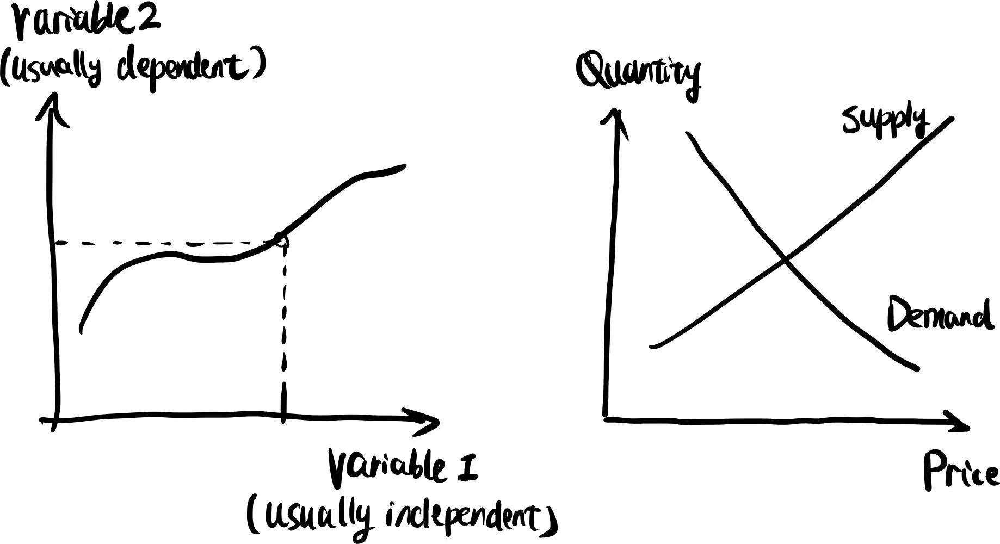
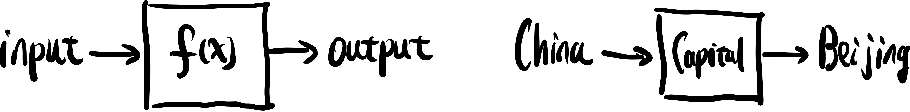
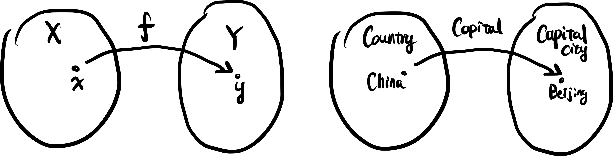

### 函数 (function)

听到"function", 第一反应可能是"方程", 事实上函数才是 function, 方程或者等式应该叫做 equation. 不细想可能会觉得他们差别不大, 不过等式通常是来解未知的, 而函数通常是用来描述两个变量之间的关系.

传统定义, 函数通常用来描述变化过程中两个变量的关系, 若有两个变量 $$x$$ 和 $$y$$, 如果对于任意一个 $$x$$ 都有一个唯一确定 (unique) 的 $$y$$ 与其对应, 那么就说 $$x$$ 是自变量 (independent variable), $$y$$ 是因变量 (dependent variable). $$x$$ 的取值范围称为函数的**定义域** (domain), $$y$$ 的取值范围称为函数的**值域** (range, codomain).

自然科学和社会科学通常会用类似下左图的形式来可视化函数, 横轴竖轴分别标记两个变量的取值范围, 通过函数图像, 便可以找到当一个变量取某个特定值时另一变量对应的值. 下右图给出了一个经济学中的例子

> 随着某商品的市场价格 (price) 增高, 生产者的生产意愿自然是增高的, 因为不考虑成本和其他因素变化的情况下 (Ceteris Paribus), 多生产的利润会更高, 因此供给曲线 (supply) 上扬, 反映出价格和供给量 (supply quantity) 的正相关; 另一方面, 消费者的消费意愿随着价格上涨自然是下降的, 于是需求曲线 (demand) 下压, 反映出价格和需求量 (demand quantity) 的负相关. 
>
> 两条曲线分别对应着供给量和需求量关于价格的函数, 两函数的焦点反映了理想的自由市场下的最终成交价格和供需量 (因为在这个点达到了供需平衡 - equilibrium) , 焦点向下作竖直线与横轴的焦点便显示了最终成交价格, 焦点向左作水平线与竖轴的交点便显示了平衡点的供需量.

在工程和计算机科学等思维里, 函数更像下左图所示, 给定一个输入 (input), 函数如同一台机器, 在加工后给出一个输出 (output); 这台机器非常可靠, 同样的输入能够稳定输出同样结果. 下右图给了一个例子

> 假想有这样一个叫做"首都" (Captital) 的函数, 放入一个国家名便会稳定输出这个国家的首都, 数学上我们可以这么标记下右图的例子 $$\text{Capital(China)=Beijin}$$.

函数的近现代定义和工科思维里的图景就很像, 考虑集合 $$X$$ 和 $$Y$$, 且它们不是空的, 如果存在某种特定的对应关系 $$f$$, 使得对于 $$X$$ 中任意一个元素 $$x$$, 在 $$Y$$ 中都有唯一确定的元素 $$y$$ 和 $$x$$ 对应, 那么就称**映射** (mapping)[^1] $$f: A\rightarrow B$$ 为从 $$X$$ 到 $$Y$$ 的一个函数, 记作 $$y=f(x), x\in X$$ 或者 $$f(X)=\{y|f(x)=y, y\in Y\}$$; 第一种记法强调元素的映射, 第二种记法强调整个集合的映射, 大括号表示 $$X$$ 被映射到了一个集合, 其元素 $$y$$ 满足竖线后的条件, 即 $$y$$ 是自 $$x$$ 通过 $$f$$ 这个映射得到, 并且 $$y$$ 属于 $$Y$$. 这样定义的直观感受类似下左图, 之前"首都"函数便类似下右图

> Country这个集合里包含了很多国家, {中国, 美国, 日本, ...}; Capital city这个集合里包含了很多城市, {北京, 华盛顿, 东京, ...}; Capital这个函数便描述了Country中的元素和Capital city中的元素的对应关系.

**单射, 满射, 双射**

一个函数 $$f:X\rightarrow Y$$ 若满足, 如果 $$f(a)\neq f(b)$$ 则 $$a\neq b$$ 对于任何属于 $$X$$ 的 $$a$$ 和 $$b$$, 那么它便是单射的

[^1]: Mapping 这个词用在这很贴切, map有地图的意思, "映射"和地图上的每个点对应着实际区域上的一个个位置很相似.