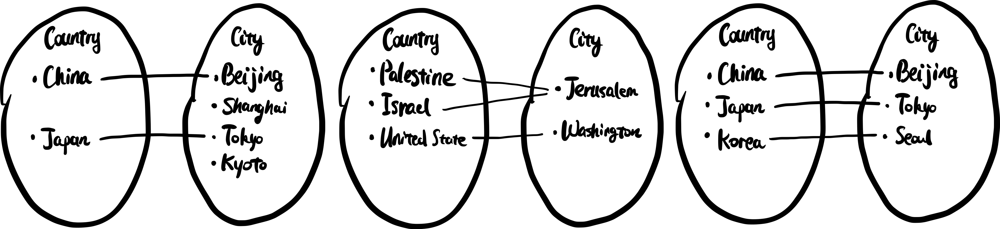

### 单射, 满射, 双射 (injection, surjection, bijection)

一个函数 $f:X\rightarrow Y$ 若满足, 如果 $f(a)\neq f(b)$ 则 $a\neq b$ 对于任何属于 $X$ 的 $a$ 和 $b$, 那么它便是**单射**的 (injection, one-to-one)[^1].

一个函数 $f:X\rightarrow Y$ , 若它的值域 (range) 和陪域 (codomain) 一致, 即对于任意 $y\in Y$, 都存在至少一个 $x\in X$ 满足 $f(x)=y$[^2], 那么它便是**满射**的 (surjection, onto).

一个同时单射又满射的函数是**双射**的 (bijection, one-to-one correspondance).

还是以Captial这个函数为例子, 下面给出了单射, 满射, 双射三种情况分别的图示

> 左: 单射但不满射;
> 中: 满射但不单射;
> 右: 双射.

### 奇偶性 (parity \doge)

若一个函数满足 $f(-x)=-f(x)$, 即改变输入值 (自变量) 的正负号, 输出值 (因变量) 的正负号也改变, 这个函数便是**奇函数** (odd function). 图像上它是关于原点对称的.

若一个函数满足 $f(-x)=f(x)$, 即改变输入值 (自变量) 的正负号, 不影响输出值 (因变量) , 这个函数便是**偶函数** (even function). 图像上它是关于 $y$ 轴对称的.

当然, 奇函数和偶函数事实上是很特殊的两类函数, 更多的函数既不是奇函数又不是偶函数.

一些运算规律:

- 奇函数 + 奇函数 = 偶函数
  证明: 假设存在两个奇函数 $f(x)$ 和 $g(x)$, 令 $(f+g)(x) := f(x) + g(x)$, 即 $(f+g)(x)$ 这个函数是原本两函数之和. 根据奇函数的定义, $f(-x)=-f(x)$ 且 $g(-x)=-g(x)$, 将两式相加得 $f(-x)+g(-x)=-f(x)-g(x)$, 即有 $(f+x)(-x)=-(f+g)(x)$, 可见 $(f+g)(x)$ 是偶函数.
- 偶函数 + 偶函数 = 偶函数
  本条及接下来的证明与上一条类似, 可以当作练习.
- 奇函数 ×/÷ 奇函数 = 偶函数
- 偶函数 ×/÷ 偶函数 = 偶函数
- 奇函数 ×/÷ 偶函数 = 奇函数
- 偶函数 ×/÷ 奇函数 = 奇函数

### 反函数 (inverse function)

浅浅地非专业地叙述一下反函数. 设函数 $y=f(x)\ (x\in X)$ 的值域是 $Y$, 若存在一个函数 $g(y)$ 使得 $x= g(y)\ (y\in C)$, $g(x)$ 便叫做 $f(x)$ 的**反函数** (inverse function), 可以记作 $x=f^{-1}(y)$, 它的定义域和值域分别是原函数的值域和定义域。

图像上, 反函数和原函数关于 $y=x$ 对称.

在求反函数时要特别注意反函数与原函数的定义域和值域. 例如 $y=f(x)=x^2$, 因为 $(\pm x)^2=y$, 反函数可能是 $x=f^{-1}(y)=\sqrt{y}$ 也可能是 $x=f^{-1}(y)=-\sqrt{y}$ , 但是不能是 $x=f^{-1}(y)=\pm\sqrt{y}$, 因为这样便不符合函数定义了, 一个输入值不可以有多个输出值, 或则说一个自变量不能对应多个因变量 (但是多个因变量对应一个自变量是允许的, 可以参考满射但不单射的图例). 这里反函数取正或负取决于原函数的定义域, 若$y=f(x)=x^2, x\ge 0$, 则$x=f^{-1}(y)=\sqrt{y}$; 若 $y=f(x)=x^2, x\le 0$, 则$x=f^{-1}(y)=-\sqrt{y}$.

### 隐函数 (implicit function)

有的时候可能需要用函数来表达一个比较复杂的图像, 举一个简单一点的例子, 一个圆心位于原点的单位圆, 圆上任意一点到圆心距离都是 $1$, 于是有 $x^2+y^2=1$, 用前面学习的函数的形式表达这个关系, 有

$y=\begin{cases}\sqrt{1-x^2}\\-\sqrt{1-x^2}\end{cases}.$

这样似乎还没有起先的 $x^2+y^2=1$ 这个形式美观, 因此不妨还是用 $x^2+y^2-1=0$ 来表述单位圆上的 $x$ 与 $y$ 的关系. 类似这样, 利用一个【同时关于 $x$ 与 $y$ 的表达式 $F(x,y)=0$】来确定【 $y$ 关于 $x$ 的函数】的表达式, 我们称之为**隐函数** (implicit function); 为表区分, 前面介绍的类似 $y=f(x)$ 的函数, 称为**显函数** (explicit function).

[^1]: One-to-one 是更"纯正"英语的说法, 比较通俗, injection 是来自法语的舶来词, 更具高级感; 后面的 onto 和 surjection 同.
[^2]: 介绍一下符号语言: $\exist$ - 存在; $\forall$ - 对于所有. 于是这句话可以这么表述: $\forall y\in Y, \exist x\in X \text{ s.t. } f(x)=y$ (s.t.=such that 可以译为"使得"). 但是通常情况下, 还是尽量避免符号语言而使用自然语言来描述.