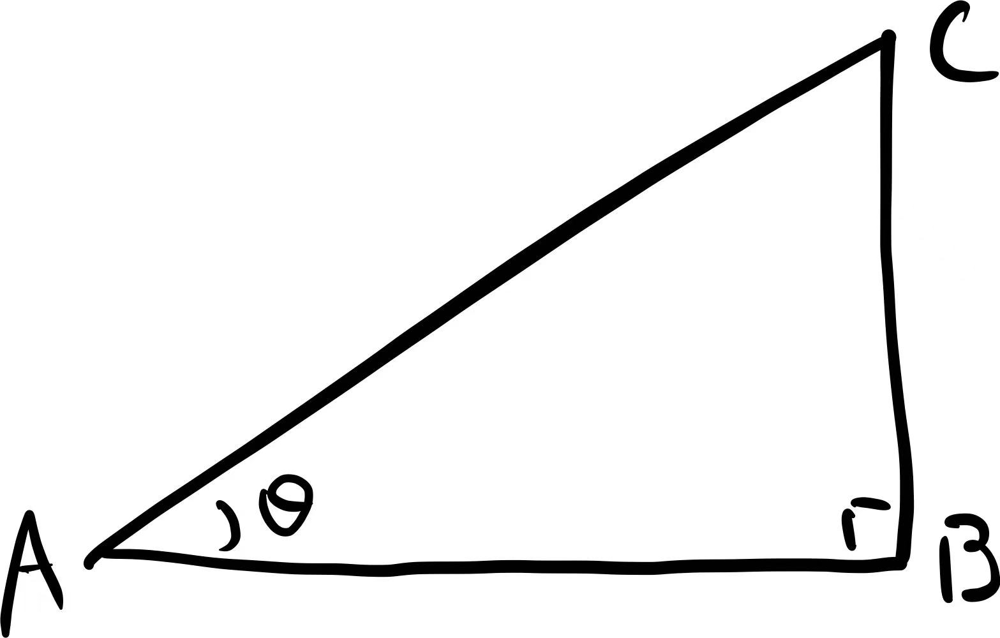
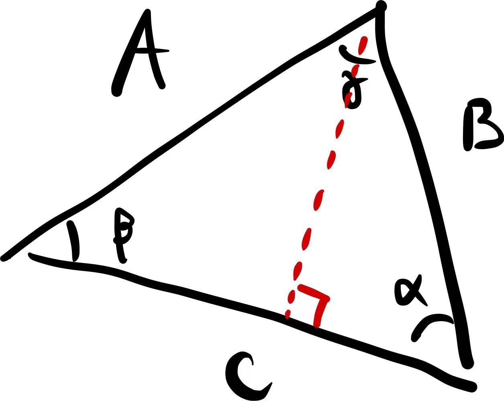
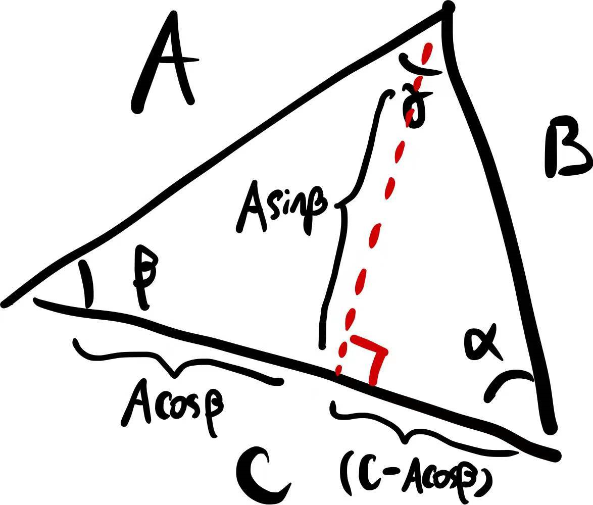

### 三角函数 (Trigonometry)

三角函数最基本的使用应该是表示直角三角形的变长比. 如下图所示, 三角形 $$ABC$$ 为直角三角形, 将 $$\angle BAC$$ 记作 $$\theta$$, 对于两条直角边 $$AB$$ 和 $$BC$$, 边 $$AB$$ 在 $$\theta$$ 边上, 称它为**邻边** (adjacent), 边 $$BC$$ 在 $$\theta$$ 对面, 称它为**对边** (opposite), 剩余的边 $$AC$$ 被称为**斜边** (hypotenuse)。

易见, 各变长比仅和 $$\theta$$ 相关[^1], 三角函数便是用来表示各个比例的, 常用的三角函数有

$$\begin{align*}\cos\theta&=\frac{邻边}{斜边}=\frac{AB}{AC},\\
\sin\theta&=\frac{对边}{斜边}=\frac{BC}{AC},\\
\tan\theta&=\frac{对边}{邻边}=\frac{BC}{AB}.\end{align*}$$

不难看出$$\tan\theta=\frac{\sin\theta}{\cos\theta}$$.

另外还有

$$\begin{align*}\sec\theta&\equiv\frac{1}{\sin\theta},\\
\csc\theta&\equiv\frac{1}{\cos\theta},\\
\cot\theta&\equiv\frac{1}{\tan\theta}.\end{align*}$$

$$\csc$$ 很多时候也记作 $$\text{cosec}$$.

一个非常实用的关系, 直角三角形中有**勾股定理** (Pythagorean theorem): 斜边边长平方等于两直角边边长的平方之和, 即 $$AC^2=AB^2+BC^2$$; 两边同时除以 $$AC^2$$ 便有

-  $$1=\cos^2\theta+\sin^2\theta$$.[^2]

**正弦定律 Law of sine**

将三角形三个角分别记作 $$\alpha$$, $$\beta$$, 和 $$\gamma$$, 将它们的对边分别记作 $$A$$, $$B$$, 和 $$C$$. 先是结论:

-  $$\frac{A}{\sin\alpha}=\frac{B}{\sin\beta}=\frac{C}{\sin\gamma}$$.

推导如下:

如上图所示, 以 $$C$$ 为底做高, 将原本的三角形分为左右两个直角三角形, 这条高利用左边的直角三角形可以表示为 $$A\sin\beta$$, 利用右边的直角三角形则是 $$B\sin\alpha$$, 于是有 $$A\sin\beta=B\sin\alpha$$, 整理可得 $$\frac{A}{\sin\alpha}=\frac{B}{\sin\beta}$$; 再做另一条高重复前面的操作, 便可得到完整的结论.

**余弦定律 Law of cosine**

还是先上结论:

-  $$B^2=A^2+C^2-2AC\cos\beta$$,

即, 【一条边的边长平方】等于【另两条边的边长平方之】和加上【两倍的 (另两条边边长的乘积) 乘以 (另两条边的夹角的余弦)】. 

推导如下:

如下图所示, 依旧利用底边 $$C$$ 上的高将其分为左右两个直角三角形; 左边的直角三角形, 利用斜边 $$A$$ 和角 $$\beta$$, 两直角边分别可以表示为 $$A\cos\beta$$ 和 $$A\sin\beta$$, 于是右边的直角三角形边长便可表述为 $$A\sin\beta$$ 和 $$(C-A\cos\beta)$$; 对右边的直角三角形使用勾股定理

$$\begin{align*}B^2&=A^2\sin^2\beta+(C-A\cos\beta)^2\\
&=A^2\sin^2\beta+C^2+A^2\cos^2\beta-2AC\cos\beta\\
&=A^2+C^2-2AC\cos\beta.\end{align*}$$

其中等式的后两行用到了之前得出的 $$1=\cos^2\theta+\sin^2\theta$$.

[^1]: 当然也可以说和除了直角外的另一个角 $$(90^\circ-\theta)$$ 相关; 边长比可以通过一个除直角外的角确定是因为, 除直角外另一角相等的直角三角形都相似, 它们的边长比是一致的。

[^2]:  三角函数的平方: cos(x)^2^ 通常理解为 cos((x)^2^); cos^2^x 约定俗成表示 (cos(x))^2^.