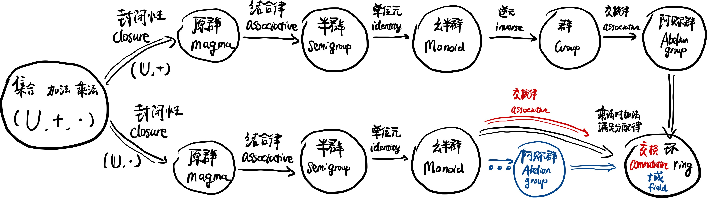

一点点绕行 (detour).

### 虚数和复数

考虑一个一元二次方程 $ax^2+bx+c=0$, 它的解有
$
\begin{aligned}
0&=a\left(x^2+\frac{b}{a}x+\frac{c}{a}\right)\\
0&=x^2+\frac{b}{a}x+\frac{c}{a}\\
0&=x^2+\frac{b}{a}x+\left(\frac{b}{2a}\right)^2-\left(\frac{b}{2a}\right)^2+\frac{c}{a}\\
0&=\left(x-\frac{b}{2a}\right)^2-\left(\frac{b}{2a}\right)^2+\frac{c}{a}\\
\left(x-\frac{b}{2a}\right)^2&=\left(\frac{b}{2a}\right)^2-\frac{c}{a}\\
&...\\
x&=\boxed{\frac{-b\pm\sqrt{b^2-4ac}}{2a}}.
\end{aligned}
$

上式最后的结论便是求根公式, 不难看出整个推导过程实际上就是配方, 其中根号前面的"加减"是因为对等式两边同时开方时, 正负两种情况都是正确的.

我们在此之前接触到的数字都还限于实数范围内, 因此会要求 $\left(b^2-4ac\right)$ 是正的, 以保证开方之后的结果是"有意义的", 然而"从来如此, 便对么?"

之前也出现了, 不能被表示成分数形式的数字, 我们的研究范围从有理数扩充到了实数; 现在, 若 $\left(b^2-4ac\right)$ 是负的, 按照当前的理解, 它不能被开方, 那是不是又到了这样一个神圣的时刻, 我们需要拓展我们研究的数字的范围?

既然如此, 不如规定 $\sqrt{-1}\equiv i$, 作为新的一类数字的单位, 因为之前的数字叫"实数", 那么这一类新的数字就不妨叫做"**虚数**" (imaginary number) 吧. 一个既包含实数部分, 又包含虚数的部分的数字, 我们就叫它"**复数**" (complex number), 记作 $\mathbb{C}$.

**运算规律**

考虑若干个复数, $z_1=a+bi$, $z_2=c+di$,  $z_3=e+fi$...

- **加法**: $z_1+z_2=(a+c)+(b+d)i$. 实数部分和虚数部分可以分开计算, 应该不难看出复数和加法是构成**阿贝尔群**的 (即它具有封闭性和结合律, 有单位元和逆元, 并且有交换律, 详细参见001).
- **乘法**: $z_1\times z_2=(a+bi)\times(c+di)\\=ac+adi+bci+bdi^2=(ac-bd)+(ad+bc)i.$
  不难看出, 复数和乘法也构成阿贝尔群.
- 乘法对于加法满足**分配律**, 即,  $(z_1+z_2)\times z_3=z_1\times z_3+z_2\times z_3$, 证明留作练习[^1].

以上三条已经足够使得复数与加法和乘法构成一个**环** (ring), 事实上, 环只需要乘法是半群 (semi-group, 满足结合律和有单位元) 即可.

- **减法**: 因为加法存在逆元, 所以减去一个数, 可以视作加上这个数的加法逆元, 即:  $z_1-z_2=(a+bi)-(c+di)\\\Rightarrow z_1+(-z_1)=(a+bi)+(-(c+di))=(a-c)+(b-d)i$
- **除法**: 不难发现每个非零的元素都有乘法逆元, 因此除以一个数可以视作乘上这个数的乘法逆元, 即: 因为 $z_2\times\frac{1}{z_2}=\frac{c+di}{c+di}=1$, 于是 $z_1\div z_2=z_1\times\frac{1}{z_2}=\frac{a+bi}{c+di}$.

> 一点小插曲, $\frac{a+bi}{c+di}$ 应该怎么化简呢, 怎么写成简单的实数部分加上虚数部分的形式呢?
> 回顾一下无理数的"分母有理化", 例如有 $\frac{a+\sqrt{b}}{c+\sqrt{d}}$, 我们会将分子分母同时乘以 $(c-\sqrt{d})$ 将分母变为有理数, 便有 $\frac{(a+\sqrt{b})(c-\sqrt{d})}{c^2-d}$.
> 类似的, 当我们尝试化简 $\frac{a+bi}{c+di}$时, 我们也不妨对分子分母同时乘以 $(c-di)$, 于是有 $\frac{(a+bi)(c-di)}{c^2+d^2}$, 分母便变为了实数, 再稍加化简便可转化为一个实数加上一个虚数的形式.
> 我们称 $(c-di)$ 是 $(c+di)$ 的**复共轭** (complex conjugate)[^2].

像上述这样可以进行加减乘和除零外除法, 并满具足一些特定的阿贝尔群的特点和分配律的代数结构, 换言之一个满足交换律的环 (交换环 commutative ring) 附加上除零外元素的除法运算, 构成一个**域** (field), 可以记作 $\mathbb{F}$, 常见的例子有有理数域, 实数域, 复数域.

环, 交换环, 域的关系 [SparkAndShine - 知乎 (zhihu.com)](https://www.zhihu.com/people/SparkandShine) http://sparkandshine.net/

[^1]: 事实上, 很多情况下, 之前提到的很多知识点, 例如单位元, 零元, 逆元都分左右, 分配律也有左分配律和右分配律, 但是目前讨论的情况都是满足交换律的, 所以可以不区分左右.

[^2]: 两头牛背上的架子称为轭, 轭使两头牛同步行走. 共轭就描述了两个对象这样一种相生相随的关系.