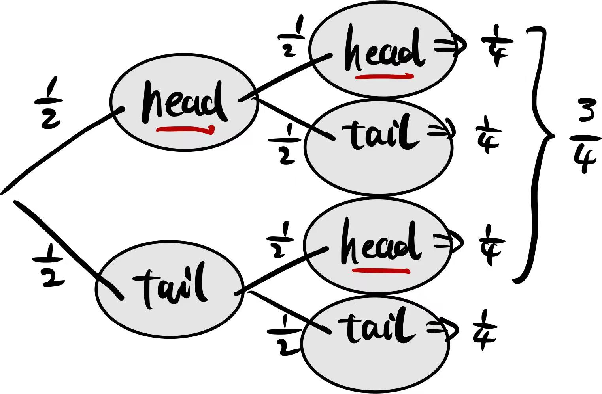

> 迂回辗转似要终了, 先前之缭绕令得前路似有柳暗花明之势...

### 自然常数 (natural constant) 

通常自然常数会以下面两个例子引出:

**复利**

考虑一个奇怪的银行, 年利率是 $100\%$, 也就是说, 存入 $1$ 个货币, 到了年底便有

$1\times(1+100\%)=2.$

更奇怪的一点, 这家银行的单位时间利率不会因为存款周期改变, 也就是说, 存 $0.5$ 年的利率是 $0.5\times100\%=50\%$, 那么存半年连本带利取出, 再重新存入, 到了年底会怎么样?

$1\times\left(1+\frac{100\%}{2}\right)^2=2.25.$

年底的存款变多了! 那么如果存入更短的周期, 连本带息取出, 然后再存入, 重复这个操作到年末, 会怎么样呢? 考虑存取三次:

$1\times\left(1+\frac{100\%}{3}\right)^3\approx2.37$.

可以发现年底存款变得更多了. 那如果这样存取的操作足够频繁, 到年底有可能赚取无限多的货币吗? 很可惜, 答案是否定的. 先上结论

$\lim_{n\rightarrow\infty}\left(1+\frac{1}{n}\right)^n\approx2.71828.$

虽然还没正式的介绍过"**极限**" (limit), "**收敛**" (converge) 这些感念, 但是上式表的的意思是: 左边的 $\lim$ 是取极限 - limit - 的意思, 取当 $n$ 趋向于无穷 (infinity) $\infty$; 右边则是被取极限的形式, 在上式中, 右边的 $n$ 便需要趋向于无穷.

计算上的话, 我们可以代入尽可能大的 $n$, 大多数科学计算器是可以胜任这个估算的; 或者我们可以使用二项式展开 (参见【007】), 省略一些步骤, 不难得到

$\lim_{n\rightarrow\infty}\left(1+\frac{1}{n}\right)^n=\frac{1}{0!}+\frac{1}{1!}+\frac{1}{2!}+...=\sum_{n=0}^\infty\frac{1}{n!}.$

可以看到求和的形式, 加的项是逐渐变小的, 这个"变小"是足够快得, 使得整个求和是收敛的 (即有限的), 当然这个求和收敛的严格证明还算留到之后再细说.

既然复利的极限趋向于一个具体的数, 于是我们便规定这个数字叫自然常数:

$\boxed{\lim_{n\rightarrow\infty}\left(1+\frac{1}{n}\right)^n\equiv\mathrm{e}=2.71828...}$

**抽卡**

这也是一个经典的例子, 例如抽卡出货的概率是 $\frac{1}{x}$, 那么不出货的概率便是 $100\%-\frac{1}{x}$; 日常我们会觉得, 比如抛硬币正面概率是 $\frac{1}{2}$, 那么抛 $2$ 次大概率上应该能出一个正面, 而事实上, 抛两次还是有挺大概率不出正面的,

从上图可见, 有 $\frac{1}{4}$ 的概率抛出两次反面; 即, 反面的概率是 $1-\frac{1}{2}=\frac{1}{2}$, 两次抛硬币互为独立事件, 因此两次都是反面的概率直接是这两个独立事件概率的乘积

$\left (1-\frac{1}{2}\right)^2=0.25.$

掷骰子也是一样, 我们总会觉得, 掷 $6$ 次总"应该"出一个六点吧, 而事实上, 不出六点的概率是 $1-\frac{1}{6}=\frac{5}{6}$, 于是掷 $6$ 还是有可能不出六点的, 概率是

$\left (1-\frac{1}{6}\right)^6\approx0.33.$

回到抽卡的例子, 如果出货的概率非常非常小: 卡池里有茫茫多的 n 卡, r 卡, ... , 只有那么一张 ssr, 要从几乎无限多的卡里抽出一张 ssr 来 (抽完要放回) , 但是相应的, 卡池越大抽卡次数也越多, 于是, 经历了无限次的抽卡后, 依旧有不出货的概率

$\lim_{n\rightarrow\infty}\left (1-\frac{1}{n}\right)^n=0.367879...$

同样可以利用二项式展开来估算

$\lim_{n\rightarrow\infty}\left (1-\frac{1}{n}\right)^n=\frac{1}{0!}-\frac{1}{1!}+\frac{1}{2!}-\frac{1}{3!}...=\sum_{n=0}^\infty\frac{1^{n}}{n!}.$

这个值事实上是 $\frac{1}{\mathrm{e}}$. 证明如下:

$\begin{aligned}\left(\lim_{n\rightarrow\infty}\left (1-\frac{1}{n}\right)^n\right)^{-1}&=\lim_{n\rightarrow\infty}\left (1-\frac{1}{n}\right)^{-n}\\\text{(Let }m&=-n\text{ )}\\&=\lim_{n\rightarrow\infty}\left (1+\frac{1}{m}\right)^m\\&\equiv\mathrm{e,}\end{aligned}$

可见 $\boxed{\lim_{n\rightarrow\infty}\left (1-\frac{1}{n}\right)^n=\frac{1}{\mathrm{e}}}$.

**衰变**

这是笔者个人的一些经历, 本人高中阶段接触的物理教材是比较简单的那种, 于是衰变, 半衰期之类的讲得浅显, 大致有以下结论:

- 单独一个原子衰变是一个完全随机的过程, 即我们不可知它具体的衰变时间; 然而一堆同一种放射性原子, 经过一段时间, 未衰变的原子数量是之前的一半, 这一段时间便叫做**半衰期** (half-life), 记作 $t_{1/2}$;
- 每经过一个半衰期, 未衰变的原子数量是在这个半衰期前的数量的半; 即, 假设某种元素的某个放射性同位素半衰期为一分钟, 一开始有 $1000$ 个这样的原子, 经过一分钟后, 大约还有 $500$ 个没有衰变, 再经过一分钟后, 还有大约 $250$ 个没有衰变...

于是, 用一个关于时间的函数来表示还未衰变的原子的数量便是

$N(t)=N_0\times\left(\frac{1}{2}\right)^{t/t_{1/2}}.$

但是用 $\frac{1}{2}$ 作为底数看起来就很随意, 为什么不能是其他的比例呢? 应该也是可以的, 既然可以用变成原来 $\frac{1}{3}$ ,  $\frac{1}{4}$ , ... 的"三分之一衰期", "四分之一衰期", ... 来表述某个时间还剩下多少未衰变的, 有没有更"自然"而不那么任意的底数呢? 于是便有**衰变常数** (decay constant)

$\lambda:=\frac{\ln(2)}{T},$

使得还未衰变的原子的数量可以表述为

$N(t)=N_0\mathrm{e}^{-\lambda t}.$

这其实是一个换底数的操作 (参见【002】), 不具体推导. 自然常数来了, 于是上面这个式子便"自然"起来了 (其实还没有). 当时初见这个公式时, 稍稍满意了一些, 但也不知道自然常数作为底数的深意; 直到很后来, 才知道当<u>一个东西的变化率和它本身的大小成正比时</u> (比如这个衰变这个例子, 单位时间衰变的原子数量和当前未衰变的原子的数量是成正比的), <u>自然函数总会"自然地"出现</u>.

