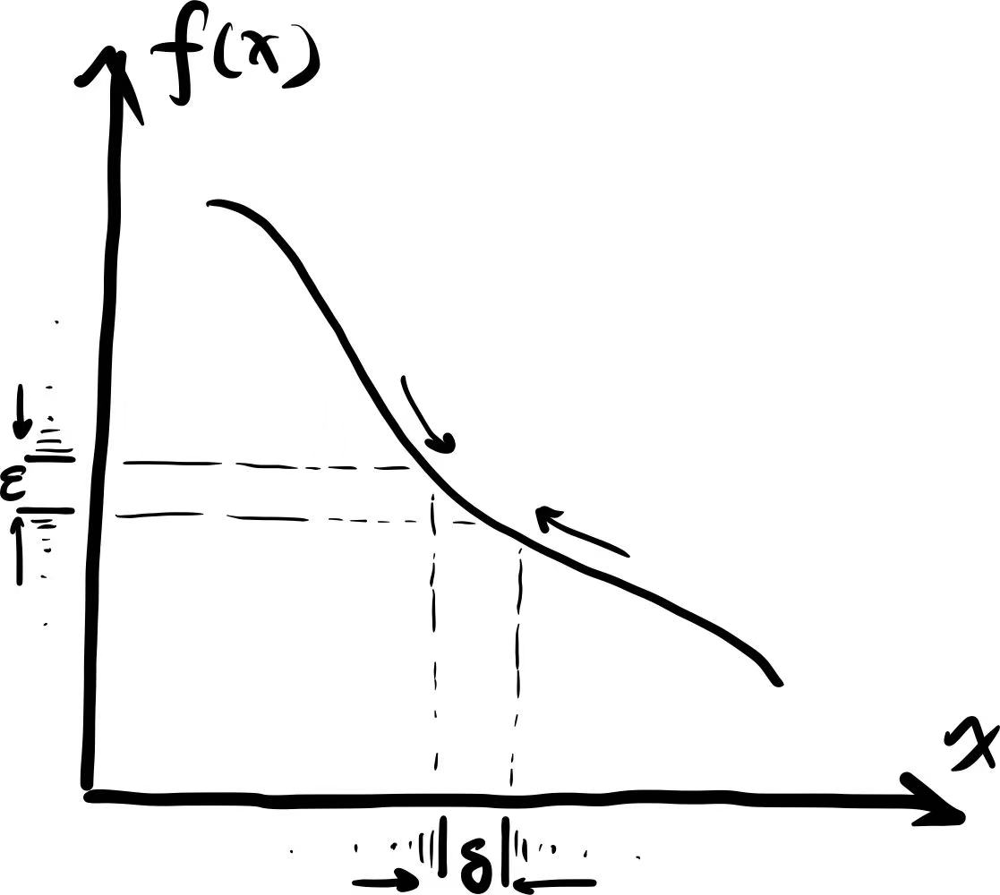
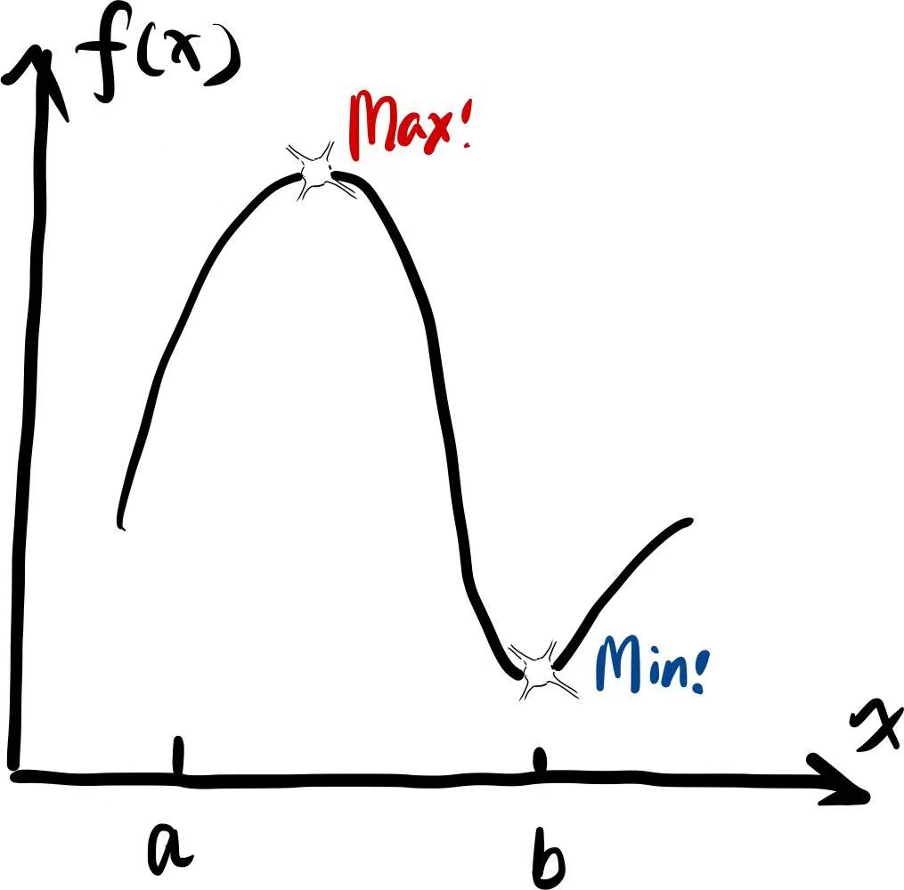
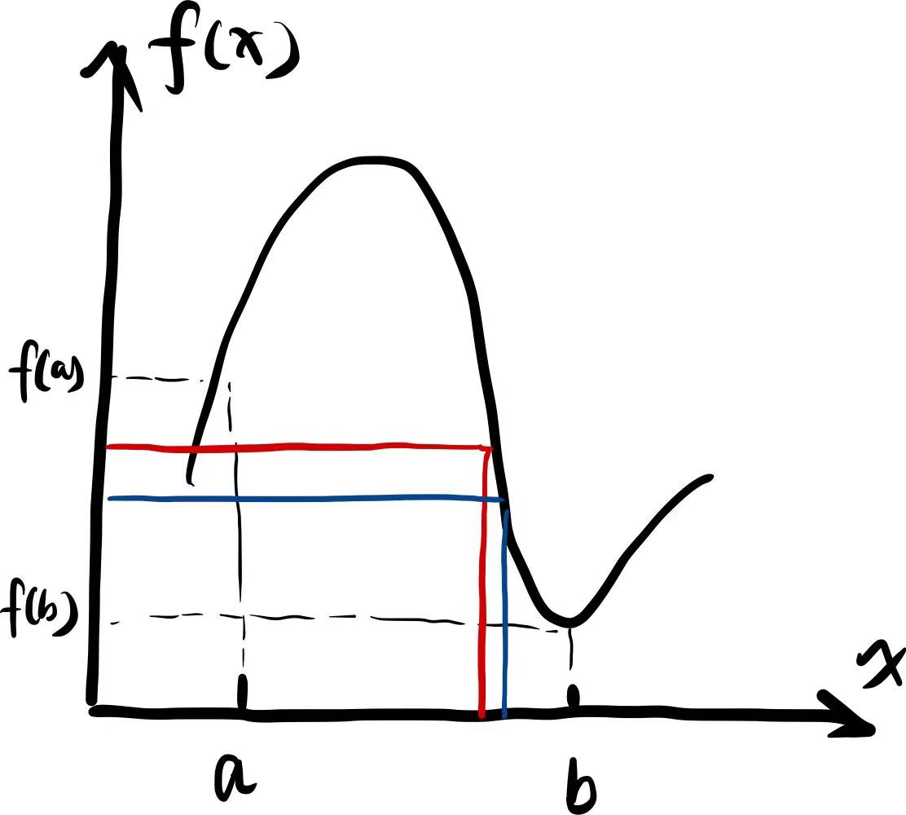
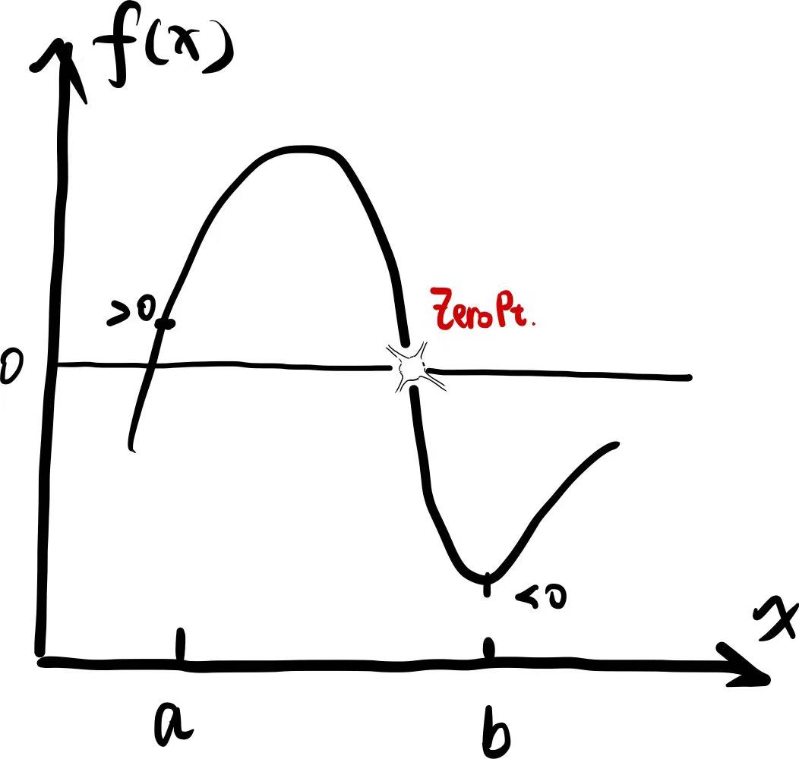

> 天 工 开 物 !
>
> 「Made in Heaven!」要开始加速了[^1]

跳过一些内容: 集合 (set), 点集拓扑 (point set topology), 数列与级数 (sequence and series); 如果您希望习得更加严谨的数学语言, 那么可以移步 Walter Rudin - *Principles of Mathematical Analysis* (俗称 baby Rudin[^2]).

### 极限 (limit)

**定义**: 当 $x$ 趋向于 $p$ 时, $x\rightarrow p$ , $f(x)$ 趋向于 $q$, $f(x)\rightarrow q$ , 记作 $\lim_{x\rightarrow p}f(x)=q.$

用 $\epsilon - \delta$ 语言 (出现了!) 来说, $\lim_{x\rightarrow p}f(x)=q$ 便是: 对于任意的 $\epsilon>0$ , 存在 $\delta>0$ 使得【若 $0<|x-p|<\delta$,  便有 $|f(x)-q|<\epsilon$ 】[^3].

为什么要用 $\epsilon - \delta$ 语言? 原本的"趋向于"其实很不严格, 什么叫趋向于呢, 于是 $\epsilon - \delta$ 语言如是说道:

- 我先任意选定一个 $\epsilon$,
- 然后我要试着找到一个 $\delta$,
- 使得 $x$ 与 $p$ 足够接近时 - 有多接近呢? 它们差的绝对值 (或者说"距离", 不过这边还没定义距离, 233) 小于 $\delta$  - 便有 $f(x)$ 与 $q$ 足够接近 - 多近呢? 他们差的绝对值小于 $\epsilon$.
- 若对于任意小的 $\epsilon$, 总能找到一个这样的 $\delta$, 那么便可以放心地说, 确有$\lim_{x\rightarrow p}f(x)=q$.

> **例子**: 一个平凡的情况 (a trivial case), $f(x)=ax$, 证明 $\lim_{x\rightarrow 1}f(x)=a$.
>
> **思路** (草稿纸上或者脑子里的部分): 对于任意 $\epsilon>0$ 我们需要找到 $\delta>0$, 满足当 $0<|x-1|<\delta$ 时, $|f(x)-a|<\epsilon$ 成立.
>
> - $|f(x)-a|=|ax-a|=a|x-1|$
>
> - 令上式小于 $\epsilon$, 发现有 $|x-1|<\epsilon/a$
> - 令 $\delta=\epsilon/a$ , 即可出锅食用 (bushi).
>
> **证明** (写下来的正式的书面的部分): 对任意 $\epsilon>0$ , 令 $\delta=\epsilon/a$, 则当 $0<|x-1|<\delta$ 时, 有
>
> - $|f(x)-a|=|ax-a|=a|x-1|<a\delta<\epsilon$.
> - 于是根据极限的定义,  $\lim_{x\rightarrow 1}f(x)=a$
>
> Q.E.D[^4]
>
> **吐槽**: 鄙人学分析的时候学得就很不到位, 写证明的时候常常向同学"借鉴", 时常觉得, 证明本身并不难写, 难得是想到并"构造"出一些证明需要的东西, 就如在上面的例子中构造一个 $\delta=\epsilon/a$; 殊不知"借鉴"的那些作业其实只有上面例子中【证明】的部分, 而【思路】部分被写在草稿纸上丢掉了.
> 这种狡猾如雪地上的狐狸一般用尾巴扫去自己的踪迹的行为...
> 于是有这样的说法:
>
> 一位菲尔兹得主告诉我, 顶级的数学家们会秘密地像物理学家一样思考, 等他们得到证明的一个大框架之后, 他们再用 epsilon 和 delta 的语言把证明过程包装起来.

- 若 $f(x)$ 在 $x\rightarrow p$ 处存在极限, 这个极限是**唯一**的 (unique). 

考虑 $\lim_{x\rightarrow p}f(x)=a$, $\lim_{x\rightarrow p}g(x)=b$, 极限还存在以下规律 (啊, 美好的线性) :

- $\lim_{x\rightarrow p}(f\pm g)(x)=a\pm b$;
- $\lim_{x\rightarrow p}(fg)(x)=ab$;
- $\lim_{x\rightarrow p}\frac{f}{g}(x)=\frac{a}{b}$, 若 $b\neq 0$.

> 回收一个坑. 【002】中提到过 $\mathrm{0}^0$ 是未被定义的问题, 一种解释便是, 若希望用极限来定义它的取值, 那么应该从 $\lim_{x\rightarrow0}x^0$ 出发, 得到 $1$, 还是应该从 $\lim_{x\rightarrow0}0^x$ 出发, 得到 $0$? 

### 连续性 (continuity)

**定义**: 对于一函数 $f(x)$, 对于任意的 $\epsilon>0$ , 存在 $\delta>0$ 使得【对于某个特定的 $x_0$, 若有 $x$ 满足 $|x-x_0|<\delta$, 便有 $|f(x)-f(x_0)|<\epsilon$】, 那么我们便可以说, $f(x)$ 在 $x_0$ 处连续.

- 若 $f(x)$ 和 $g(x)$ 连续, 那么 $f(g(x))$ 也连续.
- 若 $f(x)$ 和 $g(x)$ 连续,  那么 $(f\pm g)(x)$, $fg(x)$, $\frac{f}{g}(x)$ 都连续, 最后一条要求 $g(x)$ 对于任意 $x$ 不为 $0$.

**极值定理 (extreme value theorem)**

若函数 $f(x)$ 在区间 $[a,b]$ 连续, 则 $f(x)$ 必然在区间 $[a,b]$ 存在最大值和最小值.

**介值定理 (intermediate value theorem)**

若函数 $f(x)$ 在区间 $[a,b]$ 连续, 且有 $f(a)<C<f(b)$ 或 $f(a)>C>f(b)$, 那么总是存在 $c\in(a,b)$ 或者说 $a\le c\le b$ 使得 $f(c)=C$.

**零点定理 (zero theorem)**

若函数 $f(x)$ 在区间 $[a,b]$ 连续, 且$f(a)f(b)<0$, 则存在 $c\in(a,b)$ 使得 $f(c)=0$.

[^1]: ジョジョの奇妙な冒険 Part 6 ストーンオーシャン
[^2]: Baby = 数学分析原理 *Principles of Mathematical Analysis*; Papa/Big = 实分析与复分析 *Real and Complex Analysis*; Grandpa = 泛函分析 *Functional Analysis*; 好好地学严格的数学, 逃不掉这三本分析, 这个系列也就看个乐子.
[^3]: 其实这里的定义还是很不严谨, 比如没有说明定义域和值域. 为了省笔墨下文都默认取值范围在合适的区间内.
[^4]: Quod erat demonstrandum - 这被证明了.