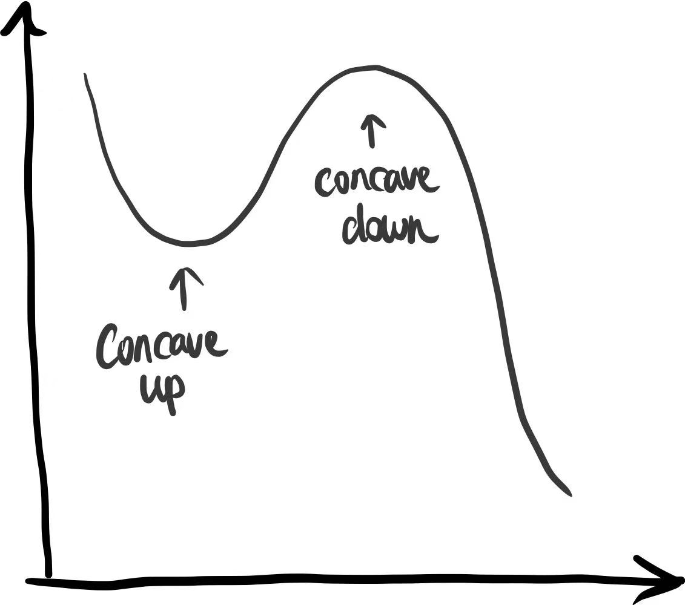
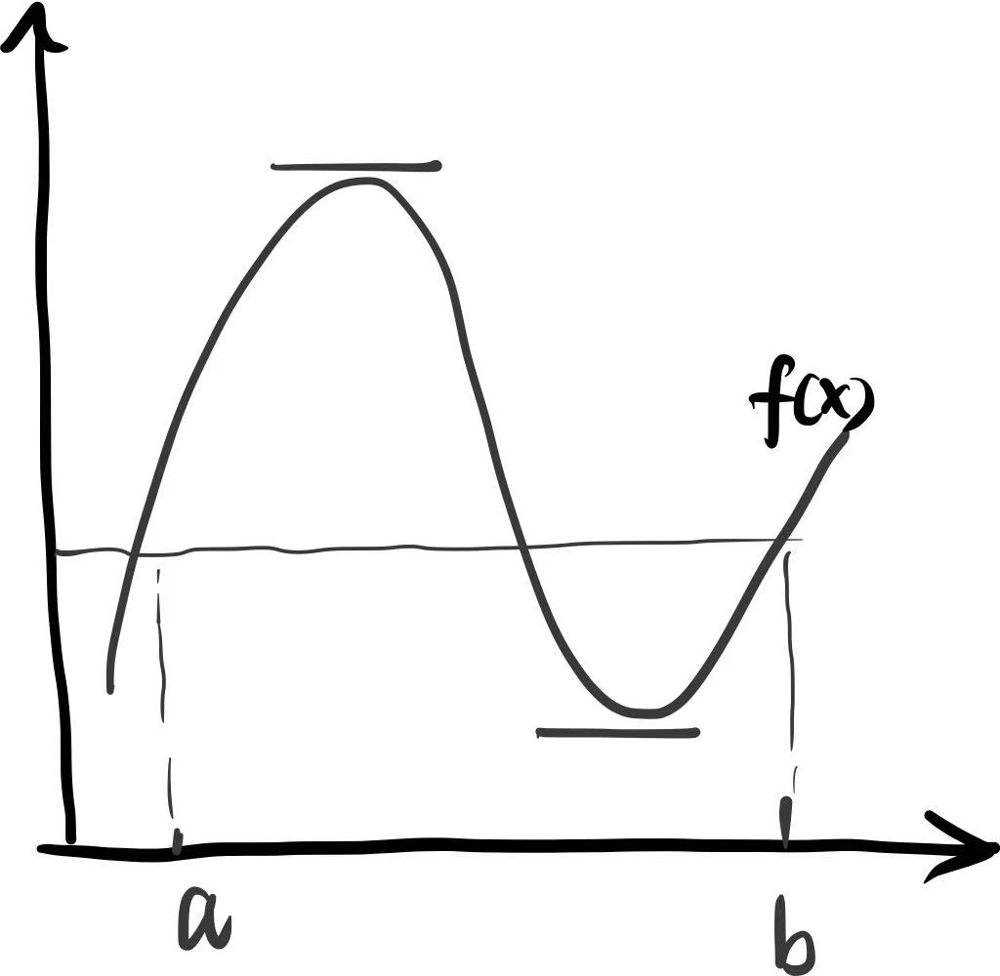
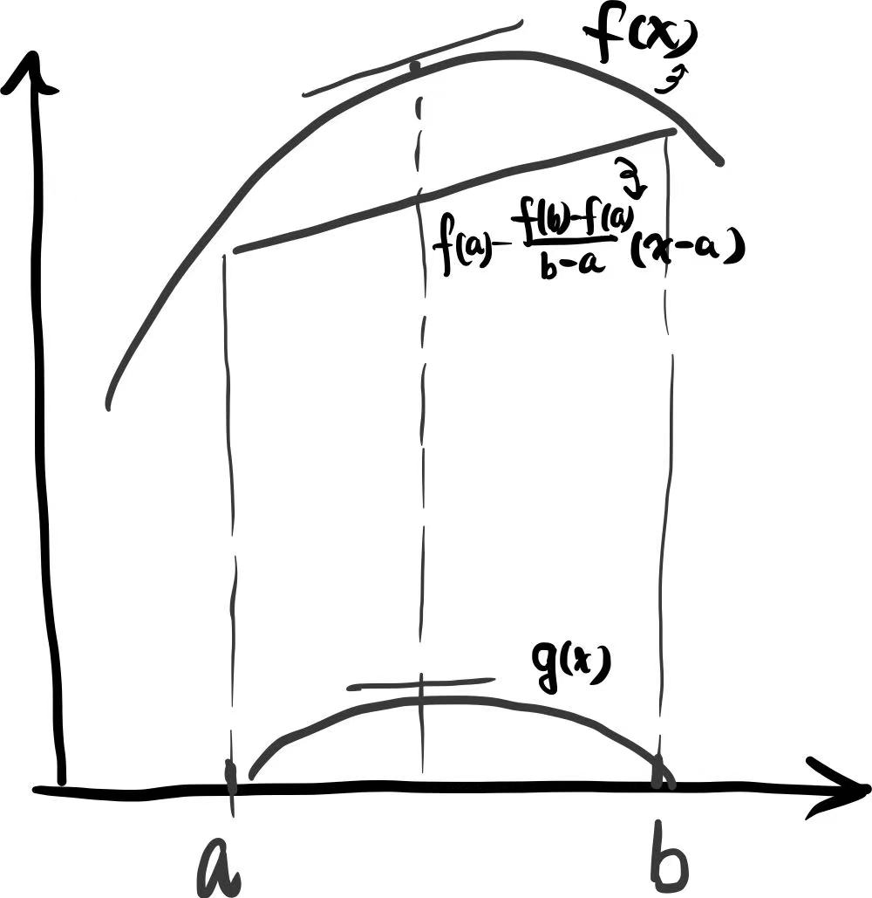
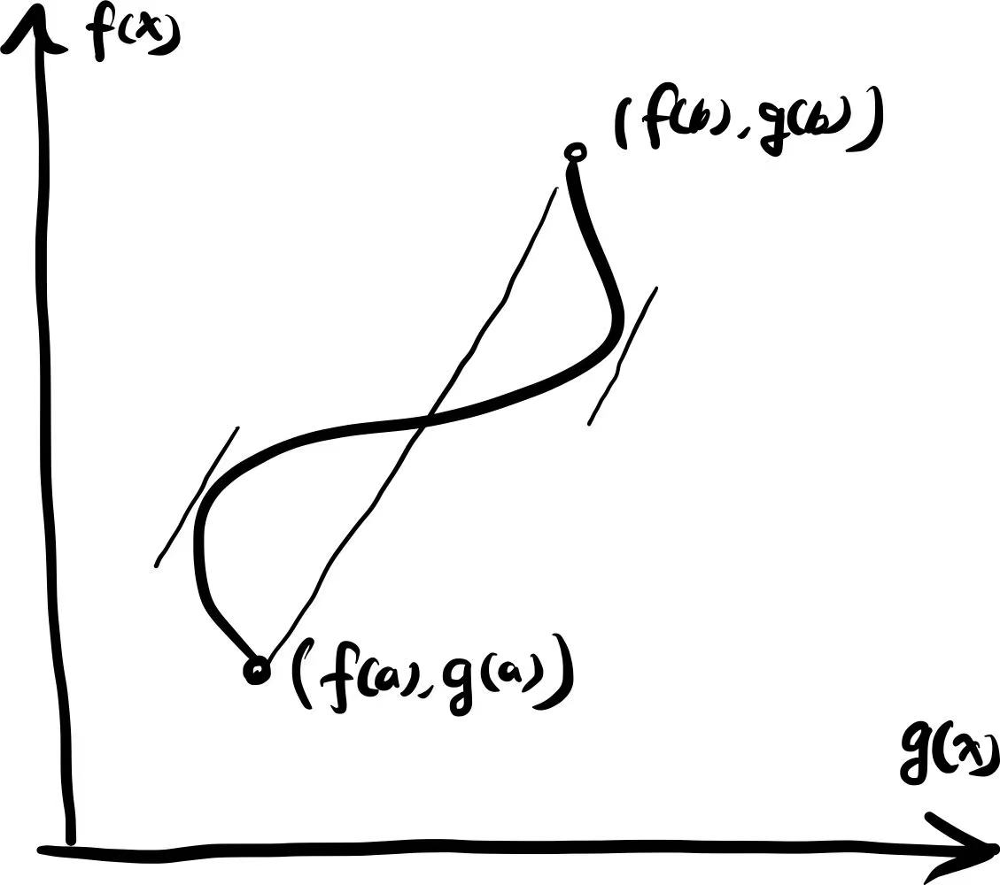

### 导数的应用

先前我们有利用导数求函数的切线过, 这里我们继续来看导数还有那些应用.

**一次导和极值**

导数可以视作切线的斜率, 所以可以利用导数的正负判断函数的增减性, 当导数大于$0$ 时, 函数是递增的, 当导数小于$0$ 时, 函数是递减的.

若函数 $f(x)$ 有局域的最大或最小值 (统称极值) 在 $x=c$ 处, 且 $f'(x)$ 在 $x=c$ 处是被定义的, 那么 $f'(c)=0$.

> 不太严谨的证明:
>
> - 考虑 $x=c$ 附近足够小的邻域 (neighborhood) , 使得在此领域内 $f'(x)$ 是连续的;
> - 因为 $f(c)$ 是极值: 则在 $x=c$ 的一侧, 有 $f'(x)>0$  (切线斜率为正, 函数递增); 另一侧, 有 $f'(x)<0$ (切线斜率为负, 函数递减);
> - 利用零点定理 (参见【011】) , 这个领域中必然有一点使得 $f'(x)=0$, 利用极限可得这个点恰好在 $x=c$ 上.

> 一个 trivial 的例子:
>
> 利用上述性质, 我们来找一下二次函数的顶点. 
>
> 若有函数 $f(x)=y=ax^2+bx+c$, 于是 $f'(x)=2ax+b$, 当 $f'(x)=0$, $2ax+b=0$, 于是 $x=\frac{b}{2a}$. 将 $x=\frac{b}{2a}$ 代入原函数, 得到 $y=f\left(\frac{b}{2a}\right)=\frac{4ac-b^2}{4a}$.
>
> 这个结论和配方得到的结论是一致的 $y=a\left(x-\frac{b}{2a}\right)^2+\frac{4ac-b^2}{4a}$.

对于更复杂的函数, 也可以用同样的思路来求极值

- 先对函数求导;
- 令导数为 $0$, 求得导数为 $0$ 处的自变量取值;
- 将求得的自变量取值代入原函数, 得到函数极值.

**二次导和凹凸性**

考虑一个有二次导的的函数[^1]:

- 若 $f''(x)>0$, 则函数是上凹的 (concave up);
- 若 $f''(x)<0$, 则函数是下凹的 (concave down);

对于二次函数而言, 上凹下凹便对应着开口向上和开口向下.

函数的凹凸性发生变化的点我们称之为拐点 (point of inflection), 有时也称为驻点. 在拐点处, $f''(x)=0$ 或不存在 (例如趋向于无穷).

### 洛必达法则 (L'Hôpital's rule)

在【013】中, 在求三角函数的导数时, 我们遇到了极限是不定式/未定型的情况, 先前我们利用几何法绕开了这种情况, 现在我们来看怎么和这种情况刚正面.

**罗尔中值定理 (Rolle's theorem)**

若 $f(x)$ 在区间 $[a,b]$ 连续, 且在区间 $(a,b)$ 可微或存在导数, 如果 $f(a)=f(b)$, 则至少存在一个点 $x=c$ 使得 $f'(c)=0$.

很直观, 一定存在一个斜率正负值变化的地方, 处非是一个 trivial 的情况, 即函数为一个常数, 那么斜率处处为 $0$.

> 证明思路:
>
> 极值定理 (参见【011】) 告诉我们区间 $[a,b]$ 存在极值, 前面我们还发现, 极值处的导数为 $0$.

**拉格朗日中值定理 (Lagrange mean value theorem)**

若 $f(x)$ 在区间 $[a,b]$ 连续, 且在区间 $(a,b)$ 可微或存在导数, 则至少存在一个点 $x=c$ 使得 $f'(c)=\frac{f(b)-f(a)}{b-a}$.

> 证明思路:
>
> 这是罗尔中值定理"加强版", 可以从罗尔中值定理出发去证明. 最后的结论可以理解为, 这个区间存在一个点使得【函数的斜率】和【函数在这个区间两个端点连线的斜率】一致. 因为斜率和连线的斜率一致, 也就是说, 【原函数】减去【两端点连线的函数】, 所得到的新的函数在这个点斜率是 $0$.
>
> - 综上, 构造这样一个函数 (最难的一步, 关于这一点的吐槽参见【011】, 因为最后的), 令 $g(x):=f(x)-f(a)-\frac{f(b)-f(a)}{b-a}(x-a)$. 
> - 易见这样一来 $g(a)=g(b)=0$,  利用罗尔中值定理, 可得存在一点 $x=c$ 使得 $g'(c)=0$.
> - $g'(x)=f'(x)-\frac{f(b)-f(a)}{b-a}$, 这里要注意 $f(a)$ 和 $f(b)$ 已经将 $x=a$ 和 $x=b$ 分别代入了原函数, 是一个具体数值了;
> - 于是 $g'(c)=f'(c)-\frac{f(b)-f(a)}{b-a}=0$, 证毕.

**柯西中值定理 (Cauchy's mean value theorem)**

若 $f(x)$ 和 $g(x)$ 在区间 $[a,b]$ 连续, 且在区间 $(a,b)$ 可微或存在导数, 且在区间 $(a,b)$ 内 $g(x)\neq0$, 则至少存在一个点 $x=c$ 使得 $\frac{f'(c)}{g'(c)}=\frac{f(b)-g(a)}{g(b)-g(a)}$.

> 证明思路:
>
> 构造一个函数 $h(x):=f(x)-f(a)-\frac{f(b)-f(a)}{g(b)-g(a)}(g(x)-g(a))$ 再利用拉格朗日中值定理易得上述结论.

为了理解这一条, 可以引入参数化曲线 (parametric curve) 这个概念. 一条曲线, 除了用类似 $y=f(x)$ 这样的形式来表示, 若是这条曲线是一个物体的运动曲线, 还可以引入时间 $t$, 这个参数 (parameter), 然后用时间来表示 $\{x,y\}$ 的变化, 即
$$
\begin{cases}
x=x(t),\\
y=y(t);
\end{cases}
$$
于是柯西中值定理可以视作, $f(x)$ 和 $g(x)$ 分别代表两个坐标值, $x$ 是一个参数, 这样一来 $f'(x)/g'(x)$ 就可以理解为这条参数化曲线的切线的"斜率"了.

回到我们的主题, 当出现类似 $f(a)=0$, $g(a)=0$, 且希望求得极限 $\lim_{x\rightarrow a}\frac{f(x)}{g(x)}$ 时, 我们可以从 $a$ 的某一侧逼近 $a$, 利用柯西中值定理可以知道在此区间一定存在一点 $x=c$ 使得
$$
\frac{f'(c)}{g'(c)}=\frac{f(x)-f(a)}{g(x)-g(a)},
$$
已知 $f(a)=0$, $g(a)=0$, 于是
$$
\frac{f'(c)}{g'(c)}=\frac{f(x)}{g(x)},
$$
再令 $x\rightarrow a$, 因为 $c$ 一定在 $x$ 与 $a$ 之间, 于是类似三明治定理的情况, 在这个极限下, $c$ 也会趋向于 $a$; 于是我们便得到了我们希望得到的结果:
$$
\boxed{\lim_{x\rightarrow a}\frac{f(x)}{g(x)}=\lim_{x\rightarrow a}\frac{f'(x)}{g'(x)}}.
$$
也就是说, 求极限时, 出现 $\frac{0}{0}$ 的不定式, 我们可以非常简单粗暴地来看它导数的极限.

> 例: $\lim_{x\rightarrow 0}\frac{\sin(x)}{x}$
> $$
> \lim_{x\rightarrow 0}\frac{\sin(x)}{x}\underset{\text{L.H.}}{=}\lim_{x\rightarrow 0}\frac{\cos(x)}{1}=1.
> $$

[^1]: 有的学科里会称为 $C^2$ 连续.