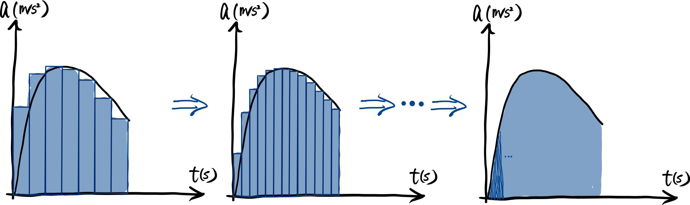

### 积分

### 求和 (summation) -复习

求和的标记 $$\sum$$ 在【007】其实已经介绍过了, 这里再复习一遍. 求和符号右边是代求和的每一项的表达式, 求和符号下面标注了右边表达式的第一项需要代入的值, 求和符号上面则标注了最后一项需要代入的值.

> 举一个例子, 小学的高斯求和法,
> $$
> 1+2+...+99+100=\sum_{n=1}^{100}n=5050.
> $$
> 高斯的思路无非是, 将这个求和拆为 $$\{1,100\}$$, $$\{2,99\}$$, ..., $$\{49,52\}$$$$, \{50,51\}$$ 的组合, 每一组的和都是 $$101$$, 一共有 $$50$$ 个这样的组合, 于是得到"一加到一百"为 $$5050$$ [^1]. 推广一下便可得到对一组公差为 $$1$$ 的等差数列求和, 和为【首项】加【末项】乘【项数】除以二. 于是有
> $$
> \sum_{n=1}^Nn=\frac{N(N+1)}{2}.
> $$
> 另有两个可能会有一些用的结论:
> $$
> \begin{aligned}
> 	\sum_{n=1}^Nn^2&=\frac{N(N+1)(2N+1)}{6},\\
> 	\sum_{n=1}^Nn^3&=\left(\frac{N(N+1)}{2}\right)^2.
> \end{aligned}
> $$
> 证明留作练习, 提示是可以利用数学归纳法 (参见【007】).

### 积分 (integration)

回顾完求和, 回到主题积分. 首先是动机 (motivation), 为什么需要积分? 我们需要导数或者说微分是通常是因为我们需要知道一些物理量的**变化率** (rate of change), 当然之前提到的求切线也可以作为一个非常 trivial 的一个情况. 积分呢, 则是反过来, 若我们已经知道变化率, 然后希望知道具体的变化量是多少, 这个时候就需要积分这个新的工具了.

图像上来说, 积分往往反映的是函数图像与 $$x$$-轴围起来的面积; 这里要注意, 不要被这种可视化个梏桎住了思想, 就像切线只是导数的一种可视化一样, 函数图像下方的面积也仅仅只是积分众多的可视化的一种, 不能局限于这一层理解.

[^1]: 小学高我一年级的一学长刚学完这一课向我耍宝的时候, 其实我也想到了类似的方法, 把求和凑成 $$\{1,99\}$$, $$\{2,98\}$$, ..., $$\{48,52\}$$$$, \{49,51\}$$ 的一对对, 最后还剩下 $$50$$ 和 $$100$$, 也能得到答案, 不过这个方法并不普适.