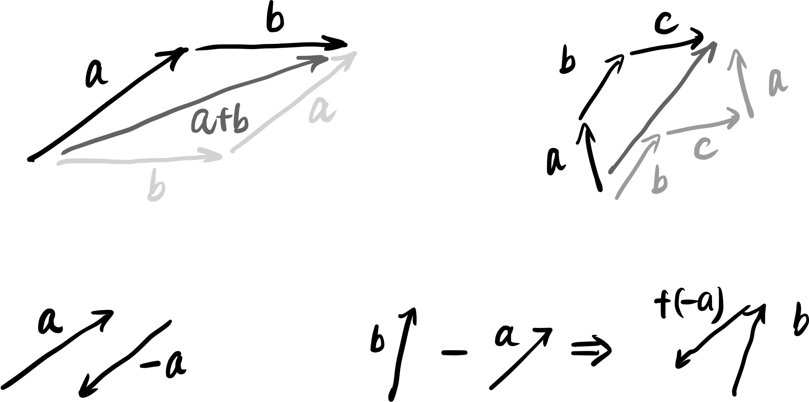
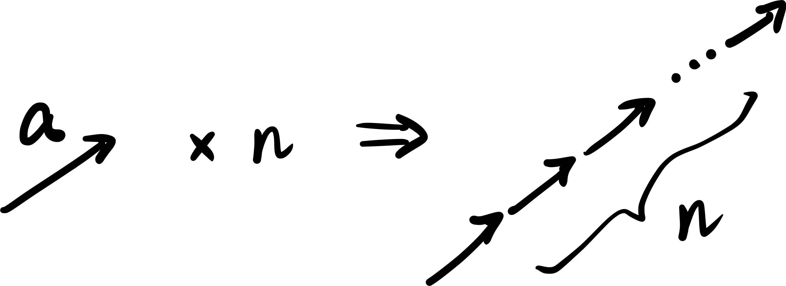
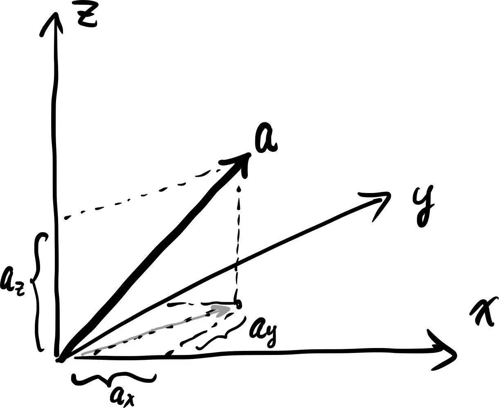

### 向量分析

前面内容大多算是基础的算术 (arithmetic), 代数 (algebra) 和一点点分析 (analysis), 其实也有那么一丢丢几何 (geometry), 但是不多; 既然现在要讲向量了, 那几何的占比就会多那么一点.

向量是什么? 从工科和绝大多数物理出发, "一个有大小又有方向"的量, 或是"类似一个箭头这样的东西", 是 good enough 的了. 但是这个视角下, 零向量经常造成各种灾难[^1]. 所以数学上, 向量有一套更完善的定义. 于是一个个人认为"好"的学习路径, 大致应该是, 先用工科和物理非常符合直觉的, 好具象化的思路先有一个大体的了解, 再在数学上进行严格化[^2]. 但是碍于篇幅, 这里还是杂糅成一个速通.

为了区分向量与标量, 在不加额外说明的情况下, 向量用粗体字母记.

### 向量的运算

**向量加法和数乘**

首先考虑一个元素为向量的集合 $\mathbb{V}$, 定义两个向量之间的加法运算, 如果这个集合是足够"好"的, 那么定义的这个向量加法应该满足**封闭性**, 即两个向量相加得到的结果应该还在这个集合里, 而且这个向量的集合和向量加法还应该满足:

1. 向量的加法满足交换律, $\forall\boldsymbol{a},\boldsymbol{b}\in\mathbb{V}: \boldsymbol{a}+\boldsymbol{b}=\boldsymbol{b}+\boldsymbol{a}$;
2. 向量的加法满足结合律, $\forall\boldsymbol{a},\boldsymbol{b},\boldsymbol{c}\in\mathbb{V}:(\boldsymbol{a}+\boldsymbol{b})+\boldsymbol{c}=\boldsymbol{a}+(\boldsymbol{b}+\boldsymbol{c})$;
3. 集合中应该存在一个零元, 使得任意向量何其相加得到那个向量本身, $\forall\boldsymbol{a}\in\mathbb{V},\exists\boldsymbol{0}\in\mathbb{V}:\boldsymbol{a}+\boldsymbol{0}=\boldsymbol{0}+\boldsymbol{a}=\boldsymbol{a}$;
4. 集合中的每一个向量都应该有对应的逆元, 使得它们相加得到零元, $\forall\boldsymbol{a}\in\mathbb{V},\exist(-\boldsymbol{a})\in\mathbb{V}:\boldsymbol{a}+(-\boldsymbol{a})=(-\boldsymbol{a})+\boldsymbol{a}=\boldsymbol{0}$.

> 也就是说, 这个向量的集合和向量加法 $(\mathbb{V},+)$ 构成阿贝尔群 (参见【006】).

接着考虑一个数域 $\mathbb{F}$, 定义数域中的一个元素和向量的数乘 (标量乘法), 如果这个数域, 向量的集合, 和定义的这个数乘是"好"的, 那么这个数乘应该也满足**封闭性**, 而且:

5. 数域中存在单位元, 使得单位元乘任意向量得到这个向量本身, $\exist 1\in\mathbb{F},\forall\boldsymbol{a}\in\mathbb{V},1\boldsymbol{a}=\boldsymbol{a}$;
6. 标量乘法分配于向量加法, $\exist c\in\mathbb{F},\forall\boldsymbol{a},\boldsymbol{b}\in\mathbb{V},c(\boldsymbol{a}+\boldsymbol{b})=c\boldsymbol{a}+c\boldsymbol{b}$;
7. 标量乘法分配于数域加法, $\exist c,d\in\mathbb{F},\forall\boldsymbol{a}\in\mathbb{V},(c+d)\boldsymbol{a}=c\boldsymbol{a}+d\boldsymbol{a}$;
8. 标量乘法一致于标量的域乘法 (也可以说是数乘的交换律吧), $\exist c,d\in\mathbb{F},\forall\boldsymbol{a}\in\mathbb{V},(cd)\boldsymbol{a}=c(d\boldsymbol{a})$.

> 在向量加法和数乘封闭的情况下, 再满足上述八条运算规律的代数系统 $(\mathbb{V},+,\cdot,\mathbb{F})$ 构成了一个 $\mathbb{F}$ 上的**线性空间** (linear space), 也叫向量空间 (vector space).

上面我们高度抽象地总结了向量加法和数乘的运算规律, 但是我们并没有具体说明"向量到底是什么?", "向量加法到底是怎么定义的?", 原因是, 任何满足上面运算规律的代数系统 $(\mathbb{V},+,\cdot,\mathbb{F})$ 我们都可以笼统地称之为一个线性空间或是向量空间, 继而 $\mathbb{V}$ 中的元素也都可以称之为向量; 这样一来, 向量这个概念实际上会比 "一个有大小又有方向"的量或是"类似一个箭头这样的东西"更宽泛, 但同时, 这样的定义反而也更严格, 不会出现零向量的方向是不被定义的这种漏洞.

接下来我们来"天地联通"[^3], 从比较具体的视角再来看看前面几条.

**向量分量**

首先从"箭头"这样的图像上, 向量加法运算的规则是非常显然的:

数乘则可看作被箭头被"放大"的倍数:

更"接地气"一点, 我们回到我们的欧氏空间, 考虑三维的情况, 将平行于 $x-$, $y-$, 和 $z-$轴的单位向量分别记作 $\hat{\imath}$,  $\hat{\jmath}$, and $\hat{k}$,

> 当然很多教材也会用 $\{\hat{x},\hat{y},\hat{z}\}$ 或者 $\{\hat{e}_1,\hat{e}_2,\hat{e}_3\}$ 等等标记, 符号上的尖尖英语中一般叫做 hat - 帽子, 来强调它们是单位向量, 即"长度"为1 (其实到目前为止还并没有定义长度这个概念). 
>
> 另外要注意一点, 学习的时候不应该太拘泥于符号的统一, 而应该去理解符号背后到底要表达什么. 阅读的时候, 可以理解作者要表达的就足矣, 不要因为标记和自己习惯的不同而不悦, 但自己整理知识点, 消化的时, 有一套相对统一的标记还是会比较方便.

这样一来一个三维欧式空间 $\mathbb{R}^3$ 里的一个向量就可以用分量形式来表示了, 就像
$$
\boldsymbol{a}=a_x\hat{\imath}+a_y\hat{\jmath}+a_z\hat{k}.
$$
这里 $a_x$, $a_y$, 和 $a_z$ 分别是向量 $\boldsymbol{a}$ 在 $x-$, $y-$, 和 $z-$轴方向上的分量, 或者说投影 (如下图所示).

除此之外, 也可以理解成, 向量 $\boldsymbol{a}$ 是 $a_x\hat{\imath}$, $a_y\hat{\jmath}$, 和 $a_z\hat{k}$ 这三个向量的和.

利用分量形式, 还可以更直观得表述 (注意不是证明) 前面的八条性质. 考虑 $\boldsymbol{a}=a_x\hat{\imath}+a_y\hat{\jmath}+a_z\hat{k}$ 和 $\boldsymbol{b}=b_x\hat{\imath}+b_y\hat{\jmath}+b_z\hat{k}$, 加法交换律便可写作
$$
\begin{aligned}
\boldsymbol{a}+\boldsymbol{b}&=a_x\hat{\imath}+a_y\hat{\jmath}+a_z\hat{k}+b_x\hat{\imath}+b_y\hat{\jmath}+b_z\hat{k}\\
&=(a_x+b_x)\hat{\imath}+(a_y+b_y)\hat{\jmath}+(a_z+b_z)\hat{k}\\
&=(b_x+a_x)\hat{\imath}+(b_y+a_y)\hat{\jmath}+(b_z+a_z)\hat{k}=\boldsymbol{b}+\boldsymbol{a}.
\end{aligned}
$$
可以观察到, 在进行向量计算时, 我们可以对各分量进行运算, 而分量的运算则是完全符合一个数域的性质的.

> 笔者本人最早是在高中自学一些力学题时, 比较系统地接触向量的, 因为高中大多数力学题会把力或是运动分解到正交 (垂直) 的方向上进行分析, 所以事实上是没有必要利用向量来计算的, 仅仅计算各个方向上的分量就足以解决几乎所有问题, 于是当时一直很疑惑引入向量的目的.
>
> 后面随着学习的深入, 特别是本科阶段接触到了向量微积分后, 才意识到使用向量带来标记上的方便; 再后面学到了量子力学后, 接触了 bra-ket (即左矢右矢), 或者说 Dirac notation (狄拉克符号), 更是意识到, 把向量视作一个抽象的对象, 而不是展开成一个具体的形如分量乘以基底, 即 $\boldsymbol{a}=\sum a_i\hat{e}_i$ 的优势; 一方面来讲, 基底的选择是比较任意的 (大多数时候, 只要完备正交归一就是"好"的, 然后怎么方便怎么来. <什么是正交归一? 先挖个坑>); 另一方面来说, 把向量看作一个抽象的对象更方便去关注它本身的一些性质, 而不会被它在某个基底下的展开束缚和梏桎住想法.

[^1]: 因为本人是老 DOTA 2 玩家, 不时看一些相关视频, 经常会刷到一些更新后, 因为零向量方向指示不清而导致的各种恶性 bug. 比如某个版本蝮蛇 A 帐新加了一个短位移技能, 若对自己释放, 则会原地跳跃, 继而会无法被选中, 进入无敌状态. 完善如 sourse 2 的游戏引擎尚且会出现类似 bug, 可见工程和物理对于向量这般定义事实上是不太妥当的.
[^2]: 非常类似学线性代数, 先从行列式那些学起, 有了一个模糊的大致的概念以后, 再接触线性空间 (done wrong -> done right). 什么是线性代数? done wrong/done right又是啥? 后面有机会再细细讲.
[^3]: 梁灿彬, 《微分几何与广义相对论》