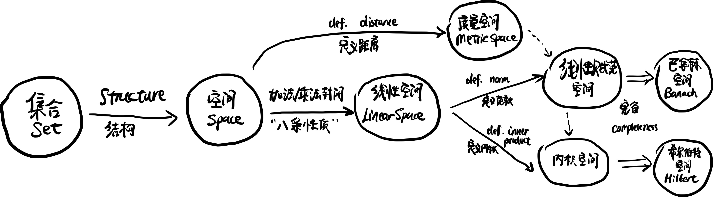

### 点乘(续)

前面比较介绍了在欧式空间里点乘的规律, 进一步地, 通过抽象化点乘这个概念, 引出了内积. 现在我们来看看两个向量的点乘到底意味着什么, 有什么用.

首先是结论:
$$
\boxed{\boldsymbol{a}\cdot\boldsymbol{b}=|\boldsymbol{a}||\boldsymbol{b}|\cos\theta}.
$$

> 上式中的 $$\theta$$ 表示向量 $$\boldsymbol{a}$$ 和 $$\boldsymbol{b}$$ 之间的夹角. 等式右边的"绝对值"作用在向量上, 表示的是求向量的"大小": 专业点说叫做"**模**" (module); 事实上这也对应着, $$L_2$$ **范数**或者说欧氏**范数** ($$L_2$$/Euclidean norm); 理工科上也常直呼 magnitude. 很多教材也会用双竖线 $$||\cdot||$$ 来标记模和范数, 用以和绝对值区分.
>
> 在三维欧式空间中, 对于 $$\boldsymbol{a}=a_x\hat{\imath}+a_y\hat{\jmath}+a_z\hat{k}$$, $$|\boldsymbol{a}|\equiv\sqrt{\boldsymbol{a}\cdot\boldsymbol{a}}=\sqrt{a_x^2+a_y^2+a_z^2}$$.

上面的结论可以用余弦定律 (参见【005】) 来推导:

> 证明: 利用余弦定律有
> $$
> |\boldsymbol{a}|^2+|\boldsymbol{b}|^2-2|\boldsymbol{a}||\boldsymbol{b}|\cos\theta=|\boldsymbol{b}-\boldsymbol{a}|^2
> $$
> 对等式右边展开有: $$|\boldsymbol{b}-\boldsymbol{a}|^2=|\boldsymbol{a}|^2+|\boldsymbol{b}|^2-2\boldsymbol{a}\cdot\boldsymbol{b}$$, 和完全平方的展开非常类似 (这一结论可以从分量的运算看出), 不过交叉项严格来说 $$-\boldsymbol{a}\cdot\boldsymbol{b}-\boldsymbol{b}\cdot\boldsymbol{a}$$, 只因[^1]点乘满足交换律, 于是两个交叉项事实上没有区别 (不难从【025】中发现点乘是满足交换律和结合律的). 于是
> $$
> \cancel{|\boldsymbol{a}|^2+|\boldsymbol{b}|^2}-2|\boldsymbol{a}||\boldsymbol{b}|\cos\theta=\cancel{|\boldsymbol{a}|^2-|\boldsymbol{b}|^2}-2\boldsymbol{a}\cdot\boldsymbol{b},
> $$
> 遂得到结论.

这样一来, 点乘的一个应用便是找到两个向量之间的夹角.

#### 插曲: 距离, 范数, 和内积 - 选读

终于要填"距离"这个坑了. 虽然前面的许多论述不时用到了"距离", 我们脑子里也都一直有"距离"这个概念, 但是事实上自这个系列开头一来, 并没有定义过距离. 正如这个系列"从零开始"一样, 我们需要"忘记"和抛弃先前的一些预有设定, 从无开始重新"发明"距离这个概念.

考虑一个空间 $$\mathbb{V}$$, 把空间中的两个元素或者说两个点 $$x,y\in\mathbb{V}$$ 的距离记作 $$d(x,y)$$ (相当于一个函数, input 是空间中的两个点, output 是一个实数). 我们希望距离应该有以下性质:

- 非负性 (nonnegative): $$d(x,y)\ge0$$, 距离应该是非负的;
- 非退化性 (nondegenerate)[^2]: $$d(x,y)=0$$ if and only if[^3] $$x=y$$, 两点间距离为零, 当且仅当这两点是同一点;
- 对称性 (symmetric): $$d(x,y)=d(y,x)$$, $$x$$ 到 $$y$$ 的距离和 $$y$$ 到 $$x$$ 的距离一致;
- 三角不等式 (triangular inequality): $$d(x,y)+d(y,z)\ge d(x,z)$$.

这些性质在欧氏空间里是易见的, 然而"距离"未必要用"直线距离"和勾股定律来定义, 比如考虑一个只有南北走向的 street 和东西走向的 avenue 的街区, 两个位置之间行车的距离便是所谓曼哈顿距离 (Manhattan distance).

> 碎碎念: 这么叫大概是因为纽约曼哈顿的城市规划使得每个街区非常方正, 道路的走向非常统一; 当然巴塞罗那在这一点做得更令强迫症一本满足.
>
> 相对论里, 时空被统一成一个整体, 于是有时会讨论两个事件之间时空上的距离, 但是时间这个维度和空间这个维度的性质又不大一样, 所以距离的定义也是非欧几里得的 (non-Euclidean). 狭义相对论里, 只讨论相对运动导致的一些现象时, 我们会使用闵可夫斯基距离 (Minkowski distance), 具体的距离以及其他物理量的运算会涉及到度规张量 (metric tensor), 这个有机会再展开了; 更复杂一点的, 在广义相对论里"引力"被视作时空的扭曲, 例如讨论静止黑洞附近的时空时, 还会用到施瓦西度规 (Schwarzschild metric).

在一个线性空间里, 我们可以定义一个范数, 一个元素的范数可以理解为这个元素到零元的距离.

>图改自知乎 @ 无尘粉笔

[^1]: 只因你太美, baby.
[^2]: 物理中 degenerate 会被翻译成"简并", 通常指多个状态占用同一个能级; 非简并便是, 每个能级只有一个状态了; 和这里距离为零便是同一点的"味道"就很像了.
[^3]: 当且仅当, 通常会简写成 iff; 若命题A iff 命题B, 则命题A可推出命题B, 命题B亦可推出命题A.