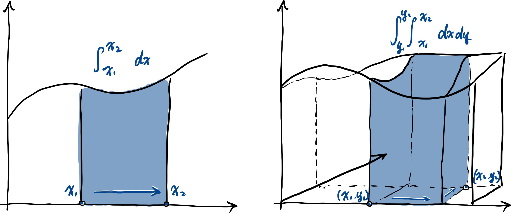
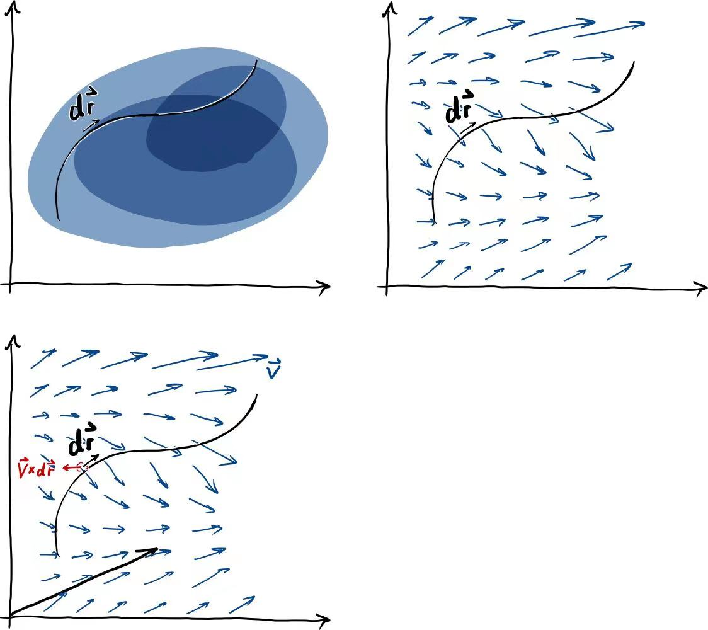

### 积分 - revisited

#### 多重积分

多重积分不是这一节的重点, 因此仅以较少的篇幅带过. 通常的 (一重) 定积分, 几何含义可以是计算函数图像下的面积, 类似的, 二重积分可以是计算一个曲面下方的体积 (如下图所示).

对于三重积分, 我们可以参考前面的, 把它理解成一个三维"超曲面"在四维的空间中下方的四维"超体积", 或者换一个思路, 我们可以考虑一个密度不均匀的三维物体, 其密度关于位置的函数给定, 已知其形状 (建立坐标系, 其形状可以用于决定积分的上下限) 的情况下, 它的质量就是一个三重积分 (回顾【019】文末).

#### 线积分

英语中, 线积分 line integral 也常叫做 path integral, 可以直译作路径积分, 虽然比较直观, 但是可能和量子场论中的路径积分混淆, 所以下文还是统一做线积分. 顾名思义, 在不止一维的情况下, 对一个多元函数的积分从一个点到另一个点, 可以不止一条曲线 (路径), 所以线积分都需要 specify 积分的曲线. 线积分可能有以下几种
$$
\begin{aligned}
&\text{(i)}\ \ \int f\ \mathrm{d}\boldsymbol{r},\\
&\text{(ii)}\ \int\boldsymbol{v}\cdot\mathrm{d}\boldsymbol{r},\\
&\text{(iii)}\int\boldsymbol{v}\times\mathrm{d}\boldsymbol{r},
\end{aligned}
$$
分别是: (i) 标量场和一个"向量微元"的数乘的积分, (ii) 向量场和"向量微元"点乘的积分, (iii) 向量场和"向量微元"叉乘的积分 (三种情况如下图所示). 这里将 $$\mathrm{d}\boldsymbol{r}$$ 称作"向量微元"并不是一个准确的描述, 通常来讲, 上述的积分都是沿着一条曲线, 所以 $$\mathrm{d}\boldsymbol{r}$$ 作为这条曲线的一段无穷小量, 应该是切于这条曲线的一个向量 (切向量 - tangent vector, 微分几何警告!).

##### (i)

考虑三维欧氏坐标系, 第一个积分可以展开作
$$
\int f\ \mathrm{d}\boldsymbol{r}=\int f(x,y,z)\mathrm{d}x\ \hat{\imath}+\int f(x,y,z)\mathrm{d}y\ \hat{\jmath}+\int f(x,y,z)\mathrm{d}z\ \hat{k},
$$
注意展开后的每一个积分, 以第一个关于 $$x$$ 的积分为例, 因为积分曲线是确定的, 所以 $$\{y,z\}$$ 不能被视作常数, 因为积分曲线已经给定, 比如以一个参数方程的形式:
$$
\begin{cases}
x=x(t)\\
y=y(t)\\
z=z(t)
\end{cases},
$$
上式可以被改写为 $$\{y(x),z(x)\}$$, 于是在这条曲线上 $$f$$ 可以被表述为仅关于 $$x$$ 的形式, 便可以对 $$x$$ 进行积分, 后两项也类似. 最后的结果应该是一个向量, 每一项积分的结果对应一个方向上的分量.

> 考虑一条可以忽略横截面积的、密度不均匀的绳, 若其单位长度的质量以一标量场给出, 那么上述积分可以描述其质量.

##### (ii)

第二个积分是比较**常见**的, 和前面一样展开有
$$
\int\boldsymbol{v}\cdot\mathrm{d}\boldsymbol{r}=\int v_x(x,y,z)\mathrm{d}x+\int v_y(x,y,z)\mathrm{d}y+\int v_z(x,y,z)\mathrm{d}z,
$$
因为欧式坐标系中单位向量的正交归一性 (类似 $$\hat{\imath}\cdot\hat{\imath}=1, \hat{\imath}\cdot\hat{k}=0$$, 复习【025】), 只有上面三项是通常而言非零的, 其中 $$\{v_x,v_y,v_z\}$$ 表示 $$\boldsymbol{v}$$ 的分量. 最后的结果应该是一个标量.

物理上常有做功的计算, 比如将一质点在一力场 $$\boldsymbol{F}(x,y,z)$$ 中, 沿一轨迹 $$C(x,y,z)$$ 移动, 做功便是
$$
W=\int_C\boldsymbol{F}\cdot\mathrm{d}\boldsymbol{r},
$$
其中积分符号下的 $$C$$ 强调积分曲线是 $$C(x,y,z)$$, 因为通常而言做功的大小是路径相关 (path dependent) 的, 也就是说即便是积分两端点一致, 不同的积分曲线得到的结果也会不一样.

##### (iii)

第三个积分可以展开作:

$$
\begin{aligned}
&\int\boldsymbol{v}\times\mathrm{d}\boldsymbol{r}\\
=&\int\begin{vmatrix}\hat{\imath}&\hat{\jmath}&\hat{k}\\v_x&v_y&v_z\\\mathrm{d}x&\mathrm{d}y&\mathrm{d}z\end{vmatrix}\\
=&\left(\int v_y\mathrm{d}z-\int v_z\mathrm{d}y\right)\hat{\imath}\\
&+\left(\int v_z\mathrm{d}x-\int v_x\mathrm{d}z\right)\hat{\jmath}\\
&+\left(\int v_x\mathrm{d}y-\int v_y\mathrm{d}x\right)\hat{k},
\end{aligned}
$$

叉乘不那么直观, 这样的线积分现实中也出现的较少, 但还是有一些用得到的例子. 

> 说到叉乘就想到右手定则 (复习【026】), 说到右手定则就想到了毕奥-萨伐尔定律 (Biot-Savart Law), which states that
> $$
> \boldsymbol{B}=\frac{\mu_0I}{4\pi}\int_C\frac{\mathrm{d}\boldsymbol{l}\times \boldsymbol{r}}{r^3},
> $$
> 上式描述了通电导线产生的磁场 $$\boldsymbol{B}$$,  $$\mu_0$$ 是一个常数 (真空磁导率), $$I$$ 是电流的大小, $$\mathrm{d}\boldsymbol{l}$$ 是电流所在的线元, $$\boldsymbol{r}$$ 是线元指向待求磁场强度所在的点 (空间上我们关注的点, 在这个点上磁场强度是 $$\boldsymbol{B}$$), $$r$$ 是 $$\boldsymbol{r}$$ 的大小 (也就是线元到关注点的距离).
>
> 注: 其实上式中, 磁场和距离平方成反比 (i.e. $$B\propto1/r^2$$), 磁场 $$\boldsymbol{B}$$ 的方向同时垂直于 $$\boldsymbol{r}$$ 和 $$\mathrm{d}\boldsymbol{l}$$, 所以叉乘只是希望得到磁场的方向, 但是 $$\boldsymbol{r}$$ 会额外 introduce 一个 $$r=|\boldsymbol{r}|$$ , 所以为了消掉这个额外的 $$r$$, 分母便成了 $$r^3$$. 这也是库仑力或引力的向量公式里出现 $$\boldsymbol{r}/r^3$$ 的原因. 在一些记号中, 规定单位向量 $$\hat{r}:=\boldsymbol{r}/r$$ 也可以使得公式看起来更自然, 当然也有教材使用 $$\hat{e}_r$$.

#### 面积分

面积分也可以有几种情况:
$$
\begin{aligned}
&\text{(i)}\ \ \int f\ \mathrm{d}\boldsymbol{a},\\
&\text{(ii)}\ \int\boldsymbol{v}\cdot\mathrm{d}\boldsymbol{a},\\
&\text{(iii)}\int\boldsymbol{v}\times\mathrm{d}\boldsymbol{a},
\end{aligned}
$$
稍难理解一些的是, 为什么面积会是一个向量; 事实上, 记 $$a=|\boldsymbol{a}|$$, 那么有 $$\mathrm{d}\boldsymbol{a}=\hat{n}\mathrm{d}a$$, 其中 $$\hat{n}$$ 是面积元 $$\mathrm{d}a$$ 处的法向量 (normal vector). 对于一个闭曲面 (closed surface), 一般将向''外''记作法向量的正方向, 对于不封闭的单连通 (simply connected, 简单来说就是没有"洞") 曲面 $$S$$, 若是给定曲面的边界 $$\partial S$$ (boundary) 的指向, 便可以用右手定则来决定法向量的方向.

> 超纲&剧透: 至于为什么曲面边界可以用偏导来表示, 需要一些外积, 外微分, 和微分形式的知识 (目前暂时只有在【026】的选读提及了一下外积), but in short, generalized 的斯托克定律 (Stokes' theorem) 告诉我们
> $$
> \int_{\partial S}\omega=\int_S\mathrm{d}\omega,
> $$
> 这里 $$\omega$$ 是待积分的微分形式. 狭义一点的版本的斯托克定律会在稍后呈现.

第 (ii) 个积分比较常用, 通常用来计算流量或者通量, 例如计算一个置于非匀强磁场中的环形电路围成的面积里的磁通量, 点乘的性质很好的解决了当磁感线与面积元不垂直的情况.

#### 体积分

体积分大多数时候将体积元视作标量 $$\mathrm{d}V$$, 于是情况无非为:
$$
\begin{aligned}
&\text{(i)}\ \ \int f\ \mathrm{d}V,\\
&\text{(ii)}\ \int\boldsymbol{v}\ \mathrm{d}V,
\end{aligned}
$$
通常第一个积分会比较常用, 例如已知一个物体的密度关于位置的函数, 待求这个物体的质量.

> 实际上, 从外积的角度出发, 考虑三维欧氏空间中的一个平行于 $$x-y$$ 平面的面元 $$\mathrm{d}\boldsymbol{a}$$ 可以写作 $$(\mathrm{d}x\wedge\mathrm{d}y)$$; 那么体元是不是就是 $$(\mathrm{d}x\wedge\mathrm{d}y\wedge\mathrm{d}z)$$ 了呢? 是也非也, 如果我们视体元为标量的化, 应该有 $$\mathrm{d}V=|\mathrm{d}x\wedge\mathrm{d}y\wedge\mathrm{d}z|$$, 但其实定义一个"向量"版本的体元也并非不可, 其几何含义可以仿照这二维面元, 解读为: 一个三维形状可以视作一个四维空间中的一个超曲面 (hypersurface), 于是向量体元 $$(\mathrm{d}x\wedge\mathrm{d}y\wedge\mathrm{d}z)$$  实际上是 $$\mathbb{R}^4$$ 中的一个"超曲面元".
>
> 这样既然有了向量版本的体元, 便可以有它与向量场的点乘叉乘了 (我们日常的 $$\mathbb{R}^3$$ 大概是鲜有情况需要用到这一点, 不过很多利用到高维向量的学科, 例如机器学习中的支持向量机等, 类似的无用的知识点大概也许可能有点作用).

