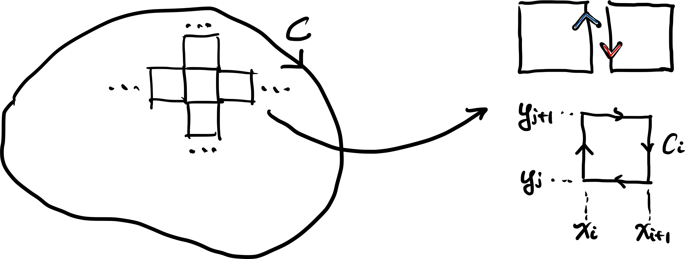

### 微积分基本定理 - revisited

回顾【019】, 微积分基本定理也叫**牛顿-莱布尼兹公式** (Newton-Leibniz formula),  which states that
$$
\int_a^bf(x)\mathrm{d}x=F(b)-F(a),
$$
其中 $$F(x)$$ 是 $$f(x)$$ 的反导数, 即有 $$F'(x)=f(x)$$. 在向量微积分中, 也有类似的一些关系.

#### 梯度定理

梯度定理 (gradient theorem) 可以看作是微积分基本定理的高维推广, according to which,
$$
\boxed{\int_\boldsymbol{a}^\boldsymbol{b}(\nabla f)\cdot\mathrm{d}\boldsymbol{r}=f(\boldsymbol{b})-f(\boldsymbol{a})},
$$

区别在于, 现在 $$f$$ 是一个标量场而非一元函数了, 积分上下限也变作了向量. 究其本质, 在【028】引出梯度时有
$$
\mathrm{d}f=(\nabla f)\cdot\mathrm{d}\boldsymbol{r},
$$
在三维欧氏空间中展开就是
$$
\begin{aligned}
\mathrm{d}f=&\left(\frac{\partial f}{\partial x}\hat{\imath}\right)\cdot\left(\mathrm{d}x\hat{\imath}\right)+\left(\frac{\partial f}{\partial y}\hat{\jmath}\right)\cdot\left(\mathrm{d}y\hat{\jmath}\right)+\left(\frac{\partial f}{\partial z}\hat{k}\right)\cdot\big(\mathrm{d}z\hat{k}\big)\\
=&\frac{\partial f}{\partial x}\mathrm{d}x+\frac{\partial f}{\partial y}\mathrm{d}y+\frac{\partial f}{\partial z}\mathrm{d}z,
\end{aligned}
$$
于是很自然地有
$$
\begin{aligned}
&\int(\nabla f(x,y,z))\cdot\mathrm{d}\boldsymbol{r}\\
=&\int\mathrm{d}f\\
=&\int\frac{\partial f}{\partial x}\mathrm{d}x+\frac{\partial f}{\partial y}\mathrm{d}y+\frac{\partial f}{\partial z}\mathrm{d}z\\
=&f(x,y,z),
\end{aligned}
$$
就有了
$$
\begin{aligned}
\int_{(x_1,y_1,z_1)}^{(x_2,y_2,z_3)}(\nabla f(x,y,z))\cdot\mathrm{d}\boldsymbol{r}=&f(x,y,z)\left|_{(x_1,y_1,z_1)}^{(x_2,y_2,z_3)}\right.\\
=&f(x_2,y_2,z_2)-f(x_1,y_1,z_1).
\end{aligned}
$$
不难发现, 对于梯度的线积分是路径无关的 (path-independent), 因为最终的结果只和起止的端点相关, 等价地, 也可以说如果梯度的积分曲线是闭合的, 则结果为零, i.e. $$\oint(\nabla f)\cdot\mathrm{d}\boldsymbol{r}=0$$. 进一步地, 我们可以说, 若一个向量场可以表述为一个标量场的梯度, 那么它的线积分便是路径无关的.

#### 格林定理

在把类似得结论推广到散度和旋度上之前, 稍稍来一点小插曲. 考虑二维的情况, 有一向量场 $$\boldsymbol{v}=v_x\hat{\imath}+v_y\hat{\jmath}$$, 然后再考虑 $$\oint_C\boldsymbol{v}\cdot\mathrm{d}\boldsymbol{r}$$ 这样一个闭合曲线上的积分. 这个积分可以被"拆解"成许多个小的闭合路径上的积分之和 (如下图所示) , 因为沿曲线积分是有方向的, 所以拆分成许多个小的闭合路径上的积分之和时, 那些重复计算的部分会因为积分时方向不同被抵消, 类似 $$\int_a^bf\mathrm{d}x+\int_b^af\mathrm{d}x=0$$. 现在关注一个小的闭合路径上的积分, 方便起见, 将路径定位一个矩形边界 (当然, 得出的结论应该时 true in general 的), 如下图右所示, 这个积分可以表示为
$$
\begin{aligned}
\int_{C_{ij}}\boldsymbol{v}\cdot\mathrm{d}\boldsymbol{r}=&\int_{(x_i,y_{j+1})
}^{(x_{i+1},y_{j+1})}\boldsymbol{v}\cdot\mathrm{d}\boldsymbol{r}+\int_{(x_{i+1},y_{j+1})
}^{(x_{i+1},y_j)}\boldsymbol{v}\cdot\mathrm{d}\boldsymbol{r}\\
&+\int_{(x_{i+1},y_j)
}^{(x_i,y_j)}\boldsymbol{v}\cdot\mathrm{d}\boldsymbol{r}+\int_{(x_i,y_j)
}^{(x_i,y_{j+1})}\boldsymbol{v}\cdot\mathrm{d}\boldsymbol{r}.
\end{aligned}
$$

根据 $$\boldsymbol{v}$$ 的定义, 以及 $$\mathrm{d}\boldsymbol{r}=\mathrm{d}x\hat{\imath}+\mathrm{d}y\hat{\jmath}$$, 利用点乘的性质, 不难发现事实上
$$
\begin{aligned}
\oint_{C_{ij}}\boldsymbol{v}\cdot\mathrm{d}\boldsymbol{r}=&\int_{(x_i,y_{j+1})
}^{(x_{i+1},y_{j+1})}v_x\mathrm{d}x+\int_{(x_{i+1},y_{j+1})
}^{(x_{i+1},y_j)}v_y\mathrm{d}y\\
&+\int_{(x_{i+1},y_j)
}^{(x_i,y_j)}v_x\mathrm{d}x+\int_{(x_i,y_j)
}^{(x_i,y_{j+1})}v_y\mathrm{d}y,\\
=&\int_{x_i
}^{x_{i+1}}v_x\Big|_{y=y_{j+1}}\mathrm{d}x+\int_{y_{j+1}
}^{y_j}v_y\Big|_{x=x_{i+1}}\mathrm{d}y\\
&+\int_{x_{i+1}
}^{x_i}v_x\Big|_{y=y_{j}}\mathrm{d}x+\int_{y_j
}^{y_{j+1}}v_y\Big|_{x=x_{i}}\mathrm{d}y,\\
=&\int_{x_i}^{x_{i+1}}\left(v_x\Big|_{y=y_{j+1}}-v_x\Big|_{y=y_j}\right)\mathrm{d}x\\&-\int_{y_i}^{y_{i+1}}\left(v_y\Big|_{x=x_{i+1}}-v_y\Big|_{x=x_i}\right)\mathrm{d}y.
\end{aligned}
$$
最后利用本节开头回顾的微积分基本定理, 有
$$
\begin{aligned}
v_x\Big|_{y=y_{j+1}}-v_x\Big|_{y=y_j}=\int_{y_j}^{y_{j+1}}\frac{\partial}{\partial y}v_x\mathrm{d}y,\\
v_y\Big|_{x=x_{i+1}}-v_y\Big|_{x=x_i}=\int_{x_i}^{x_{i+1}}\frac{\partial}{\partial x}v_u\mathrm{d}x.
\end{aligned}
$$
这样一来在一个小的闭合路径中便有
$$
\oint_{C_{ij}}\boldsymbol{v}\cdot\mathrm{d}\boldsymbol{r}=\int_{x_i}^{x_{i+1}}\int_{y_j}^{y_{j+1}}\left(\frac{\partial v_x}{\partial y}-\frac{\partial v_y}{\partial x}\right)\mathrm{d}y\mathrm{d}x.
$$

根据前面的论述, 整个延封闭曲线的积分可以视作这些小的闭合路径的积分之和, 即
$$
\oint_C\boldsymbol{v}\cdot\mathrm{d}\boldsymbol{r}=\sum_{i,j}\oint_{C_{ij}}\boldsymbol{v}\cdot\mathrm{d}\boldsymbol{r}.
$$
和这些小的闭合路径等价的二重积分对应的"面积"事实上是闭合路径围出的面积, 求和后对应的面积之和也就应该变为整个封闭曲线所围成的面积, 所以有
$$
\boxed{\oint_{\partial S}\boldsymbol{f}\cdot\mathrm{d}\boldsymbol{r}=\iint_S\left(\frac{\partial v_x}{\partial y}-\frac{\partial v_y}{\partial x}\right)\mathrm{d}A},
$$
即对一向量场沿着闭合曲线的积分, 等于其分量偏导之差的关于这一闭合曲线围成的平面的面积分; 这里为了 consistency, 将平面记作 $$S$$, 这个平面的边界记作 $$\partial S$$.

> 待考证: 可能因为积分正方向取顺/逆时针, 上式右边和其他版本差了一个符号. 

这个结论叫做**格林定理** (green theorem) 的环量形式 (circulation form), 或者说切形式 (tangential form). 叫环量是因为, 我们接下来马上要看到, 它和旋度的定理很像, 甚至 $$\left(\frac{\partial v_x}{\partial y}-\frac{\partial v_y}{\partial x}\right)$$ 这个形式有时被叫做 "s-curl" - "scalar curl" (所谓标量旋度, 旋度的二维类比). 叫切形式是因为 $$\mathrm{d}\boldsymbol{r}$$ 是切于积分曲线的.

既然有切形式, 很自然就要问, 有没有法形式 (normal form) 呢? 有:
$$
\boxed{\oint_{\partial S}\boldsymbol{f}\cdot\mathrm{d}\boldsymbol{n}=\iint_S\left(\frac{\partial v_x}{\partial y}+\frac{\partial v_y}{\partial x}\right)\mathrm{d}A},
$$
虽然还是沿着一条闭合曲线去积分, 但是切向量 $$\mathrm{d}\boldsymbol{r}$$ 换成了法向量 $$\mathrm{d}\boldsymbol{n}$$, 所以切形式的情况中 $$v_x\mathrm{d}x$$ 和 $$v_y\mathrm{d}y$$ 的项就变成了 $$v_x\mathrm{d}y$$ 和 $$v_y\mathrm{d}x$$. 这个结论也叫做格林定理的通量形式 (flux form), 不难猜它和接下来的散度定理很像.